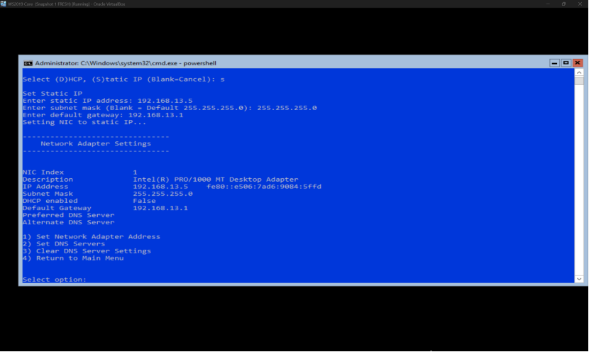
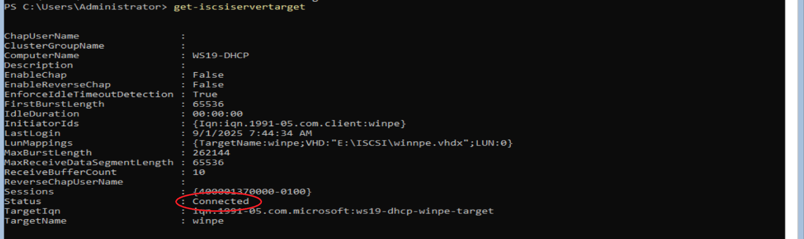
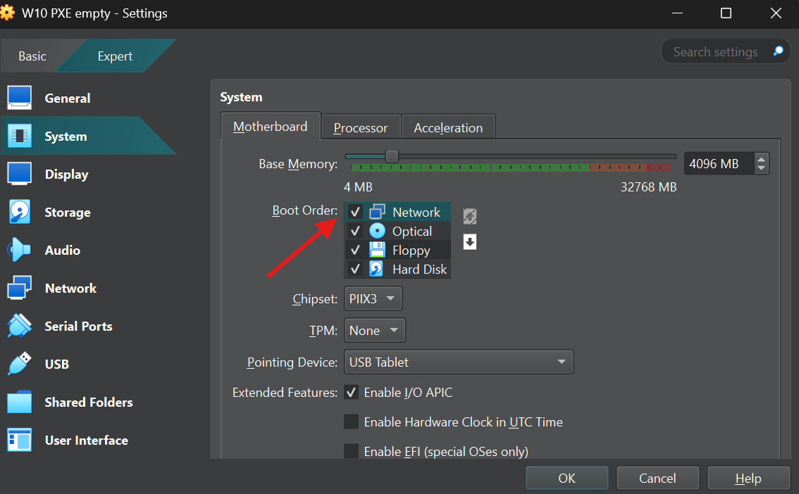
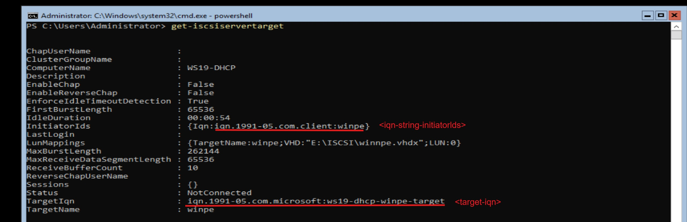

# Boot PXE

Projects: 1. Cài đặt hệ điều hành  (https://www.notion.so/1-C-i-t-h-i-u-h-nh-25f2170c3fd180f1bb23e201107e476f?pvs=21)
Trạng thái: Done
Assigned To: Thanh Nhã, Cao Thông Thái, Ngọc Bùi
Text:

*** CHUẨN BỊ
- Windows Server core 2019 Datacenter edition (Server)
- Phân vùng chứa data tệp .vhdx và winsetup (Tổi thiểu >5GB Server)
- WinPE từ Assessment and Deployment Kit (ADK) và bộ cài Windows ISO
- Card mạng hỗ trợ iPXE 1.21.1+ (Client)
- WMWare hoặc VirtualBox**

*** CẤU HÌNH IP TĨNH**

Sử dụng câu lệnh:

```bash
*sconfig*
```

Sau khi nhập sẽ hiện ra menu thiết lập cơ bản

- Tìm và gõ số tương ứng với dòng “network setting”
- Gõ index card mạng muốn đặt ip tĩnh
- Khi được hỏi về lựa chọn DHCP hay tĩnh (Static): gõ s
- Tiếp tục nhập các thông số cơ bản theo yêu cầu (IPv4, subnetmask, default gateway) để hoàn thành thiết lập
    
    
    

*** CÀI ĐẶT DHCP TRÊN WINDOWS SERVER 2019**

Sử dụng powershell và thực hiện các câu lệnh sau:

```bash
*install-windowsfeature dhcp -includemanagementtools
add-dhcpserverv4scope -name “<tên pool>” -startrange <IPv4 bắt đầu> -endrange <IPv4 cuối cùng> -subnetmask <subnet> -state active
set-dhcpserverv4optionvalue -scopeid <IPv4 Network> -leaseduration <Thời gian format d.hh:mm:ss>
set-dhcpserverv4optionvalue -scopeid <IPv4 Network> -type both* (# Đặt boot qua DHCP)
```

Ví dụ như hình


*** CÀI ĐẶT ISCSI TRÊN WINDOWS SERVER 2019**

- **Cài tính năng:**

```bash
*Install-windowsfeature fs-iscsiTarget-Server*
```

- **Xác định vị trí muốn đặt và tạo ổ đĩa ảo VHD:**

```bash
*New-iscsiVirtualDisk -Path “<Địa chỉ tạo ổ ảo vhdx>” -Size <Dung lượng GB>*
```

- **Tạo iscsi target:**

```bash
*New-iscsiServerTarget -TargetName “<Đặt tên target>” -initiatorIds “<Tham số xác định initiator VD: ‘IQN:iqn.1991-05.com.microsoft:winpe’>”*
```

- **Đặt ổ vừa tạo VHD vào target:**

```bash
*Add-IscsiVirtualDiskTargetMapping -TargetName “<Tên Target>” -Path “<Địa chỉ ổ ảo vhdx đã tạo>”*
```


*** ĐỊNH DẠNG PHÂN VÙNG CHO VHD**

Trên command prompt thực hiện các câu lệnh sau:

```bash
*diskpart* (# đi đến chức năng phân vùng)
*select vdisk file=”<Vị trí ổ ảo vhdx> VD: ‘E:\iscsi\winpe.vdhx’”*
*attach vdisk* (# mount ổ ảo)
*create partition primary* (# Tạo phân vùng)
*format fs=ntfs quick label=winpe* (# Định dạng NTFS,  label=tên phân vùng, chế độ quick)
*assign letter=W* (# Ký tự phân vùng là W:\)
*active* (# kích hoạt)
*exit*
```

*** TẢI VÀ CÀI ĐẶT MÔI TRƯỜNG WINPE QUA ASSESSMENT AND DEPLOYMENT KIT (ADK)**

- **TẢI VÀ CÀI ADK:**

Cách 1: Sử dụng một máy khác có GUI 

- Tải từ trang chính thức của Microsoft gồm ADK và add-on
- Cài đặt hai công cụ deployment tools từ ADK và add-on

Cách 2: Thực hiện trên server core

- Thực hiện bằng câu lệnh Powershell

```bash
*Invoke-WebRequest -Uri "[https://go.microsoft.com/fwlink/?linkid=2288854](https://go.microsoft.com/fwlink/?linkid=2288854)" -OutFile <Thư mục tải về VD: "C:\users\administrator\downloads\adksetup.exe">*
```

- Cài đặt bằng câu lệnh

```bash
*C:\users\administrator\downloads\adksetup.exe /quiet /installpath "C:\Program Files (x86)\Windows Kits\10" /features OptionId.DeploymentTools OptionId.WindowsPreinstallationEnvironment*
```

- **CÀI MÔI TRƯỜNG WINPE:**
- Tìm đến nơi đã cài đặt và mở Deployment tools:
Ví dụ:

```bash

cd “*C:\Program Files (x86)\Windows Kits\10\Assessment and Deployment Kit\Deployment tools”*
*start  cmd.exe*
```

- Sử dụng quyền quản trị thực hiện tạo thư mục chứa WinPE:

```bash
*copype amd64 C:\winpe*
```

- Tại ổ C:\ sẽ chứa thư mục winpe với 3 thư mục con:
+ media
+ mount
+ bootbins hoặc fwfiles
    
    
    

-**GÁN WINPE  VÀ BỘ CÀI WINDOWS VÀO PHÂN VÙNG ẢO VHD CỦA SERVER:**

- Trong thư mục media chứa các thông tin boot và hệ thống WinPE do đó ta thực hiện sao chép thư mục vào ổ ảo vhd:

```bash
*xcopy C:\winpe\media\* W:\ /E /H /K*
```

Trong đó:
+ W:\: Là phân vùng ổ ảo vhd đã được định dạng
+ /E : Sao chép tất cả thư mục con
+ /H : Sao chép tất cả file ẩn lẫn hệ thống
+ /K : Giữ nguyên thuộc tính “read-only” do mặc định sẽ bỏ thuộc tính này

- Sau khi thực hiện, ta tiến hành gán bộ cài windows từ tệp .ISO vào ổ ảo vhd:
>*mkdir W:\wsetup (# Tạo thư mục wsetup để chứa dữ liệu của tệp cài Windows .ISO)*
>*xcopy X:\* W:\wsetup\ /E /H /K* (# Thực hiện tương tự như WinPE với X:\ là phân vùng khi mount .ISO của bộ cài Windows)

*** KIỂM TRA CÀI ĐẶT SERVER KHÁC TRƯỚC KHI KIỂM THỬ TRÊN MÁY TRẠM (CLIENT)**

**-PORT 3260:**

Kiểm tra port 3260 (Dịch vụ Iscsi Target)
>netstat -ano | find str 3260
Nếu không có gì hiển thị thì thực hiện câu lệnh sau:
>restart-service wintarget (# Khởi động lại dịch vụ target)


**-TARGET ISCSI:**

Các lệnh kiểm tra ISCSI đã thiệt lập thành công
> *get-iscsiVirtualDisk* (# chứa danh sách các thông tin cơ bản của các VHD đã tạo như địa chỉ path)
> *get-IscsiServerTarget* (# chứa các thông tin cơ bản để client kết nối đến ISCSI. Trong đó thông tin trạng thái có 3 dạng:

+not-connected: Đã thiết lập được Target với VHD nhưng chưa có Client kết nối
+connected: Đã có client đang kết nối thành công
+error: lỗi do nhiều vấn đề như cấu hình phân vùng VHD sai hoặc target không chính xác…



**-FIREWALL:**

Bật các quy định (rule) được thiết lập sẵn trong Windows Server Core qua powershell: 
> *Enable-NetFirewallRule -DisplayGroup "iSCSI Service”* (# Cho phép dịch vụ ISCSI)
> *Enable-NetFirewallRule -DisplayGroup "File and Printer Sharing”* (# Tùy chọn nếu cần như ping ICMP)

*** THỰC HIỆN BOOT WINPE VÀ KHỞI ĐỘNG BỘ CÀI WINDOWS QUA IPXE VÀ ISCSI VHD**

- Đảm bảo  trong BIOS/UEFI của Client hoặc trên Client ảo (Virtual Box/VMWare) được ưu tiên boot qua mạng (Chung network với Server)
    
    
    

- Khi khởi động máy trạm qua card mạng sẽ tự động vào môi trường IPXE nếu card mạng có hỗ trợ
- Trong môi trường IPXE ta thực hiện các câu lệnh sao để nhận và boot ổ ảo vhd của server:
iPXE>*dhcp* (# Gửi dhcp discover để tìm địa chỉ IPv4 cùng mạng kết nối đến server)
iPXE>*set initiator-iqn <iqn-string-initiatorIds>* (# Đặt initiator cho iscsi để boot vhd)
iPXE>*sanboot iscsi:<IPv4 ISCSI server>::::<target-iqn>* (# Boot đến vhd chứa WinPE của server)
- Các thông tin như <iqn-string-initatorids> và <target-iqn> có thể được tìm thấy thông qua câu lệnh trên powershell
>*get-iscsiservertarget*
****
    
    
    
- Trên môi trường iPXE sẽ hiển thị như sau:
    
    
    
- Sau khi boot vào WinPE thành công ta sẽ tiến hành gọi đến bộ cài windows thông thường được xếp vào phần vùng C:\ do client đã xem ổ vhd server như ổ vật lý
- Ta cũng có thể xem chi tiết phân vùng cụ thể thông qua lệnh >notepad (# mở notepad) → open sẽ cho ta giao diện GUI trực quan File Explorer
- Khi đã xác định đúng phân vùng chứa bộ cài mà ta đã thêm khi sao chép từ .ISO của Windows, ta tiếp tục câu lệnh sau:
> c: (# Thay đổi phân vùng cụ thể là C:\)
> cd winsetup (# trỏ đến địa chỉ thư mục chứa bộ cài Windows)
>setup.exe (# Khởi động bộ cài Windows)
    
    