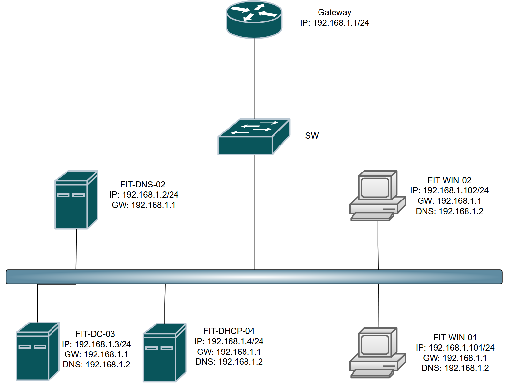
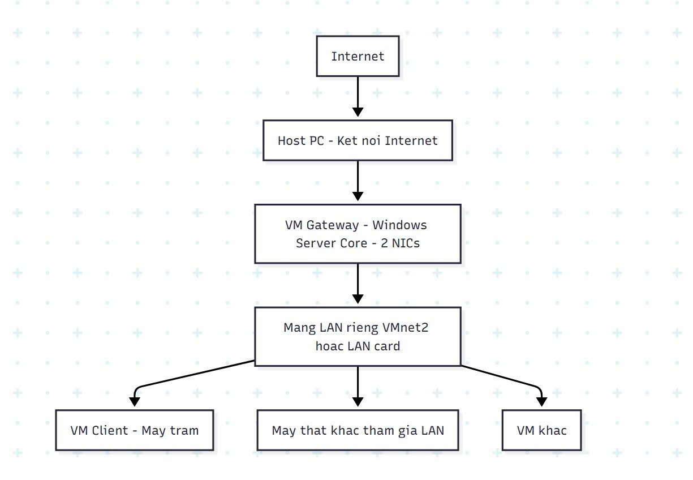

# Xây dựng hệ thống mạng LAN mô phỏng

Projects: 2. Cấu hình các dịch vụ cơ bản (https://www.notion.so/2-C-u-h-nh-c-c-d-ch-v-c-b-n-2672170c3fd180bdaa3cc044a8d9ce6f?pvs=21)
Trạng thái: Done
Assigned To: Thanh Nhã, Cao Thông Thái, Ngọc Bùi

# Sơ đồ mạng



# Chúng ta sẽ thực hiện theo thứ tự phụ thuộc:



1. **Xây dựng Máy Gateway (Router ảo).**
2. **Xây dựng Máy chủ DNS (FIT-DNS-02).**
3. **Xây dựng Máy chủ DHCP (FIT-DHCP-04).**
4. **Kiểm tra với một Máy Client (FIT-WIN-01).**
5. **Ghi chú cho Máy chủ Domain Controller (FIT-DC-03).**

---

### **Phần A: Chuẩn bị Môi trường VMware**

Trước khi tạo bất kỳ máy ảo nào, hãy đảm bảo môi trường mạng VMware của bạn đã sẵn sàng như đã thảo luận.

1. **Máy Host có 2 card mạng vật lý:**
    - **NIC 1:** Dùng cho Internet của máy Host.
    - **NIC 2:** Dành riêng cho mạng LAN ảo, đã cắm vào một Switch.
2. **Cấu hình Virtual Network Editor:**
    - Mở VMware Workstation: Edit -> Virtual Network Editor.
    - **VMnet0 (Bridged):** Đang được Bridged tới **NIC 1** (card có Internet).
    - **VMnet2 (Bridged):** Tạo một mạng mới hoặc chọn mạng có sẵn, cấu hình nó Bridged tới **NIC 2** (card dành cho LAN).
    - **Tách biệt máy Host:** Đảm bảo bạn đã vô hiệu hóa TCP/IP trên **NIC 2** của máy Host và **KHÔNG** kết nối Host virtual adapter vào **VMnet2**.

---

### **Phần B: Xây dựng Máy Gateway trên Server Core 2019**

### **B1. Tạo và Cài đặt Máy ảo**

1. Tạo máy ảo mới. Khi cài đặt, chọn phiên bản **Windows Server 2019 Standard/Datacenter** (chứ không phải "Desktop Experience").
2. **Cấu hình Phần cứng VM:** Gắn 2 card mạng:
    - Network Adapter 1: Bridged (VMnet0) -> **WAN**.
    - Network Adapter 2: Custom: VMnet2 -> **LAN**.

### **B2. Cấu hình Ban đầu với sconfig**

1. Khởi động máy ảo. Bạn sẽ được đưa vào giao diện dòng lệnh.
2. Đăng nhập và đổi mật khẩu Administrator.
3. Nếu sconfig không tự chạy, gõ sconfig và nhấn Enter.
4. **Đặt tên máy:**
    - Chọn Option 2) Computer Name.
    - Nhập tên mới, ví dụ FIT-GATEWAY, và khởi động lại.
5. **Cấu hình Mạng:**
    - Sau khi khởi động lại, mở lại sconfig.
    - Chọn Option 8) Network Settings.
    - Bạn sẽ thấy danh sách các card mạng. Hãy xác định card nào là WAN, card nào là LAN. Card WAN thường sẽ nhận được IP từ modem của bạn.
    - **Cấu hình Card LAN:**
        - Chọn index của card LAN (ví dụ: 1).
        - Chọn 1) Set Network Adapter Address.
        - Chọn S để đặt IP tĩnh (Static).
        - IP address: 192.168.1.1
        - Subnet mask: 255.255.255.0
        - Default gateway: **Để trống** (nhấn Enter).
    - **Cấu hình Card WAN:**
        - Chọn index của card WAN.
        - Đảm bảo nó đang ở chế độ DHCP. Nếu không, hãy chọn 1) Set Network Adapter Address và chọn D cho DHCP.
    - Quay lại menu chính bằng cách chọn 4) Return to Main Menu.

### **B3. Cài đặt và Cấu hình Vai trò Routing & NAT bằng PowerShell**

1. Thoát khỏi sconfig (chọn Option 15).
2. Gõ powershell để vào môi trường PowerShell.
3. **Cài đặt vai trò Routing:**
    
    ```powershell
    # Cài đặt dịch an vụ Routing và các công cụ quản lý cần thiết
    Install-WindowsFeature -Name Routing -IncludeManagementTools
    ```
    
4. **Cấu hình NAT:**
    
    ```powershell
    # Tạo một quy tắc NAT mới cho mạng nội bộ 192.168.1.0/24
    New-NetNat -Name "FIT-LAN-NAT" -InternalIPInterfaceAddressPrefix "192.168.1.0/24"
    ```
    
    - **Name "FIT-LAN-NAT"**: Đặt một tên dễ nhận biết cho quy tắc NAT .
    - **InternalIPInterfaceAddressPrefix "192.168.1.0/24"**: Chỉ định rằng bất kỳ máy nào từ dải mạng này sẽ được phép đi ra ngoài thông qua NAT.
5. **Khởi động dịch vụ để thực thi:**
    
    ```powershell
    # 1. Bảo dịch vụ tự khởi động mỗi khi bật máy
    Set-Service -Name RemoteAccess -StartupType Automatic
    
    # 2. Bật dịch vụ ngay bây giờ
    Start-Service -Name RemoteAccess
    ```
    

---

### **Phần C: Xây dựng Máy chủ DNS trên Server Core 2019**

### **C1. Tạo và Cấu hình Ban đầu**

1. Tạo máy ảo Server Core 2019 mới với **1 card mạng** nối vào VMnet2.
2. Dùng sconfig để:
    - Đặt tên máy là FIT-DNS-02.
    - Cấu hình IP tĩnh cho card mạng:
        - IP address: 192.168.1.2
        - Subnet mask: 255.255.255.0
        - Default gateway: 192.168.1.1
    - **Cấu hình DNS Server:**
        - Trong sconfig > Network Settings, chọn 2) Set DNS Servers.
        - Preferred DNS server: 127.0.0.1 (trỏ về chính nó).
        - Alternate DNS server: Để trống.

### **C2. Cài đặt và Cấu hình DNS bằng PowerShell**

1. Mở PowerShell.
2. **Cài đặt vai trò DNS:**
    
    ```powershell
    Install-WindowsFeature -Name DNS -IncludeManagementTools
    ```
    
3. **Cấu hình Forwarders:**
    
    ```powershell
    # Thêm Google DNS và Cloudflare DNS làm forwarder
    Add-DnsServerForwarder -IPAddress "8.8.8.8", "1.1.1.1"
    ```
    
4. **Kiểm tra kết nối Internet:**
    
    ```powershell
    # Lệnh ping này phải thành công
    ping google.com
    ```
    

---

### **Phần D: Xây dựng Máy chủ DHCP trên Server Core 2019**

### **D1. Tạo và Cấu hình Ban đầu**

1. Tạo máy ảo Server Core 2019 mới với **1 card mạng** nối vào VMnet2.
2. Dùng sconfig để:
    - Đặt tên máy là FIT-DHCP-04.
    - Cấu hình IP tĩnh:
        - IP address: 192.168.1.4
        - Subnet mask: 255.255.255.0
        - Default gateway: 192.168.1.1
    - Cấu hình DNS Server:
        - Preferred DNS server: 192.168.1.2 (trỏ về máy DNS).

### **D2. Cài đặt và Cấu hình DHCP bằng PowerShell**

1. Mở PowerShell.
2. **Cài đặt vai trò DHCP:**codePowershell
    
    ```powershell
    Install-WindowsFeature -Name DHCP -IncludeManagementTools
    ```
    
3. **Ủy quyền cho DHCP Server trong Active Directory (bước này chỉ cần nếu bạn có AD):**
    
    ```powershell
    # Bỏ qua nếu mạng của bạn là Workgroup
    Add-DhcpServerInDC -DnsName labtdtu.com
    ```
    
4. **Tạo một Scope (dải cấp phát IP) mới:**
    
    ```powershell
    # Tạo dải cấp phát từ 100 đến 200
    Add-DhcpServerv4Scope -Name "FIT-LAN" -StartRange 192.168.1.100 -EndRange 192.168.1.200 -SubnetMask 255.255.255.0
    ```
    
5. **Thiết lập các tùy chọn cho Scope (Gateway và DNS):**
    
    ```powershell
    # Đặt tùy chọn Default Gateway (Router) và DNS Server cho các máy client
    Set-DhcpServerv4OptionValue -ScopeId 192.168.1.0 -Router 192.168.1.1 -DnsServer 192.168.1.2
    ```
    
6. **Khởi động lại dịch vụ DHCP để áp dụng:**
    
    ```powershell
    Restart-Service -Name DhcpServer
    ```
    

---

### **Phần E: Kiểm tra với Máy Client (FIT-WIN-01)**

1. **Tạo VM:** Tạo một máy ảo Windows 10/11 mới.
2. **Cấu hình Phần cứng VM:** Chỉ cần **1 card mạng**, kết nối tới Custom: VMnet2.
3. **Cài đặt Windows.**
4. **Kiểm tra:**
    - Sau khi cài xong, máy ảo này phải **tự động nhận được IP** từ máy chủ DHCP (ví dụ: 192.168.1.100).
    - Mở CMD và gõ ipconfig /all.
    - Kiểm tra các thông số:
        - IPv4 Address: 192.168.1.100 (hoặc một IP trong dải cấp phát)
        - Default Gateway: 192.168.1.1
        - DHCP Server: 192.168.1.4
        - DNS Servers: 192.168.1.2
    - **Thực hiện ping toàn diện:**
        - ping 192.168.1.1 (Ping Gateway) -> Phải thành công.
        - ping 192.168.1.2 (Ping DNS Server) -> Phải thành công.
        - ping 8.8.8.8 (Ping ra Internet qua IP) -> Phải thành công.
        - ping google.com (Ping ra Internet qua tên miền) -> Phải thành công.

---

### **Phần F: Ghi chú cho Máy chủ Domain Controller (FIT-DC-03)**

1. **Cài đặt và cấu hình IP** cho máy FIT-DC-03 tương tự các máy chủ khác:
    - IP: 192.168.1.3/24, GW: 192.168.1.1, DNS: 192.168.1.2.
2. Cài đặt vai trò Active Directory Domain Services.
3. Sau khi cài đặt, bạn sẽ **"Promote this server to a domain controller"**.
4. Trong quá trình này, máy chủ AD sẽ tự động cài đặt và tích hợp vai trò DNS vào chính nó. Sau khi nâng cấp lên DC thành công, bạn nên đổi DNS của các máy client và máy chủ khác trỏ về IP của DC (192.168.1.3) để tận dụng DNS của Active Directory.