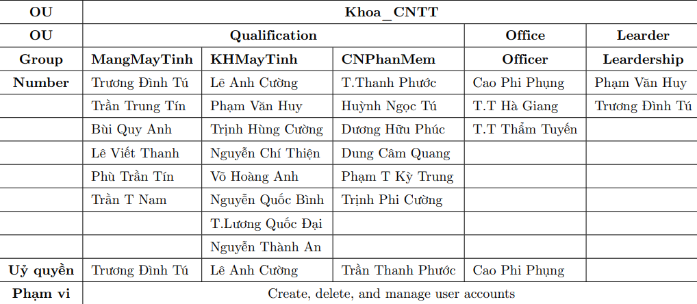

# 5. Tạo OU, Group, User và Ủy Quyền cho User

# YÊU CẦU

Tạo **OU, Group, User** trên miền labtdtu.com theo thông tin bảng bên dưới.

Ủy quyền (Delegate Control) cho các user tutd, cuongla, phuoctt, phungcp với quyền **Create, delete, and manage user accounts**.



Mô hình tổ chức như sau:


# CHUẨN BỊ

Server: FIT-DC-02 (Cài đặt AD DS).

Client: FIT-WIN-01.

# TIẾN HÀNH CÀI ĐẶT

## Tạo các OU

Trong phần này, chúng ta sẽ tiến hành tạo các **Organizational Unit (OU)** phục vụ cho việc quản lý người dùng và nhóm. Việc tạo OU giúp tổ chức hệ thống Active Directory theo từng phòng ban, khoa hoặc chức năng cụ thể, từ đó dễ dàng phân quyền và quản trị.

Thực hiện tạo OU trên máy FIT-DC-02:

```powershell
New-ADOrganizationalUnit -Name "Khoa_CNTT" -Path "DC=labtdtu,DC=com"
New-ADOrganizationalUnit -Name "Qualification" -Path "OU=Khoa_CNTT,DC=labtdtu,DC=com"
New-ADOrganizationalUnit -Name "Office" -Path "OU=Khoa_CNTT,DC=labtdtu,DC=com"
New-ADOrganizationalUnit -Name "Leader" -Path "OU=Khoa_CNTT,DC=labtdtu,DC=com"

```

Sau khi chạy các lệnh trên, ta đã có cấu trúc OU hoàn chỉnh trong domain labtdtu.com như sau:

```
labtdtu.com
└── Khoa_CNTT
		├── Qualification
		├── Office
		└── Leader
```

Kiểm tra lại bằng cách liệt kê tất cả các OU trong Domain:

```powershell
Get-ADOrganizationalUnit -Filter * | Select-Object Name, DistinguishedName
```

Hoặc chỉ liệt kê OU Khoa_CNTT và các OU con:

```powershell
Get-ADOrganizationalUnit -Filter * -SearchBase "OU=Khoa_CNTT,DC=labtdtu,DC=com" |
Select-Object Name, DistinguishedName
```

## Tạo những Users ủy quyền

Ta có thể tạo user bằng câu lệnh:

```powershell
New-ADUser -Name "Truong Dinh Tu" -SamAccountName "tutd" `
-AccountPassword (ConvertTo-SecureString "P@ssw0rd" -AsPlainText -Force) `
-Enabled $true -Path "OU=Qualification,OU=Khoa_CNTT,DC=labtdtu,DC=com"
```

Hoặc gom danh sách các user vào một biến mảng rồi dùng vòng lặp để tạo user:

```powershell
$pwd = ConvertTo-SecureString "P@ssw0rd123" -AsPlainText -Force

$users=@(
@{name=”Truong Dinh Tu”;sam=”tutd”;path=”OU=Qualification,OU=Khoa_CNTT,DC=labtdtu,DC=com”},
@{name=”Le Anh Cuong”;sam=”cuongla”;path=”OU=Qualification,OU=Khoa_CNTT,DC=labtdtu,DC=com”},
@{name=”Tran Thanh Phuoc”;sam=”phuoctt”;path=”OU=Qualification,OU=Khoa_CNTT,DC=labtdtu,DC=com”}, 
@{name=”Cao Phi Phung”;sam=”phungcp”;path=”OU=Office,OU=Khoa_CNTT,DC=labtdtu,DC=com”})

foreach ($u in $users) {
New-ADUser -Name $u.name -SamAccountName $u.sam `
-Path $u.path -AccountPassword $pwd -Enabled $true
}
```

Kiểm tra lại bằng cách liệt kê các User trong Domain:

```powershell
Get-ADUser -Filter * | Select-Object SamAccountName, Name, DistinguishedName
```

## Tạo các Groups đề yêu cầu

Tạo nhanh các Groups:

```powershell
$groups = @(
    @{Name="MangMayTinh"; Path="OU=Qualification,OU=Khoa_CNTT,DC=labtdtu,DC=com"},
    @{Name="KHMayTinh";   Path="OU=Qualification,OU=Khoa_CNTT,DC=labtdtu,DC=com"},
    @{Name="CNPhanMem";   Path="OU=Qualification,OU=Khoa_CNTT,DC=labtdtu,DC=com"},
    @{Name="Officer";     Path="OU=Office,OU=Khoa_CNTT,DC=labtdtu,DC=com"},
    @{Name="Leadership";  Path="OU=Leader,OU=Khoa_CNTT,DC=labtdtu,DC=com"}
)

foreach ($g in $groups) {
    New-ADGroup -Name $g.Name -GroupScope Global -GroupCategory Security -Path $g.Path
}

```

Thêm User vào Group:

```powershell
Add-ADGroupMember -identity "Officer" -Members "phungcp"
```

Làm tương tự với các Users khác.

## Cài đặt RSAT

Remote Server Administration Tools (RSAT) là bộ công cụ cho phép quản trị viên quản lý từ xa các dịch vụ và tính năng Windows Server, bao gồm Active Directory, DHCP, DNS, Group Policy… từ máy tính chạy Windows.

Chúng ta sẽ cài đặt RSAT trên máy client FIT-WIN-01. Để có thể cài đặt RSAT trên máy client thì chúng ta phải có kết nối mạng cho máy. 

> Lưu ý: Active Directory Users and Computers (ADUC) chỉ hoạt động trên các phiên bản Windows hỗ trợ RSAT như Windows 10 Pro, Enterprise, Education và Windows 11 tương ứng. 
Từ bản Windows 10 1809 trở lên, RSAT được tích hợp sẵn và có thể cài qua phần Optional Features. Các phiên bản Home không hỗ trợ RSAT nên không thể sử dụng ADUC. Windows 8.1 Pro và Enterprise cũng dùng được ADUC nếu cài RSAT thủ công từ Microsoft.
> 

> Link cài đặt RSAT Windows 10: https://www.microsoft.com/en-us/download/details.aspx?id=45520
> 

> Link cài đặt RSAT Windows 8.1: https://www.microsoft.com/en-us/download/details.aspx?id=39296
> 

Lệnh cài RSAT (Active Directory Tools) bằng powershell:

```powershell
Add-WindowsCapability -Online -Name Rsat.ActiveDirectory.DS-LDS.Tools~~~~0.0.1.0
```

Sau khi chạy xong, kiểm tra:

```powershell
Get-WindowsCapability -Name RSAT* -Online | ? State -eq Installed
```

Bạn sẽ thấy các module hiện Installed.

## Ủy quyền cho Users

### Ủy quyền cho các user trên có quyền Create, delete, and manage user accounts bằng cách dùng RSAT đã cài trên máy FIT-WIN-01.

### Dưới đây là cấu hình với bản windows 10 đã tích hợp sẵn (tham khảo lab 4 nếu bản windows không hỗ trợ)

Mở Active Directory Users and Computers→Chọn OU Office→Click right OU Office→Delegate conttrol→Next


Chọn Add→Nhập User phungcp


Chọn <Quyền cần ủy như trong yêu cầu>→Next→Finish


Làm tương tự cho các user khác cần được ủy quyền.

## Dùng tài khoản được ủy quyền để thêm Users mới

Đăng xuất khỏi tài khoản cũ và đăng nhập lại bằng 1 trong 4 tài khoản vừa được ủy quyền. Sau đó tạo User mới để xem đã được ủy quyền hay chưa.

Mở Active Directory Users and Computers→Chọn Qualification→Click right Qualification→New→User


Sau đó điền các thông tin cần thiết để tạo User.

Hoặc có thể dùng câu lệnh powershell như phía trên đã đề cập đến để tạo các User sau đó thêm vào Group thích hợp.

Làm tương tự để tạo hết tất cả Users yêu cầu trong bài.

### Sau đó quay lại máy FIT-DC-02 để kiểm tra tất cả User đã tạo:

```powershell
Get-ADUser -Filter * | Select-Object Name, DistinguishedName
```