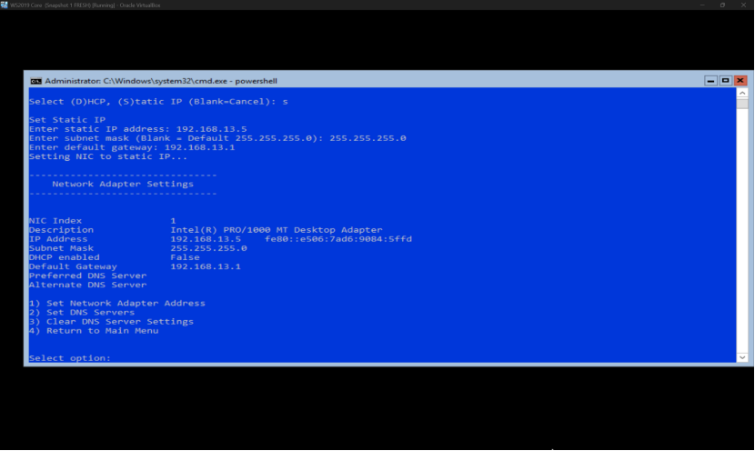
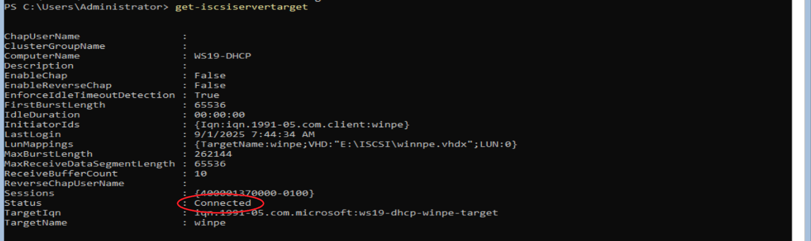
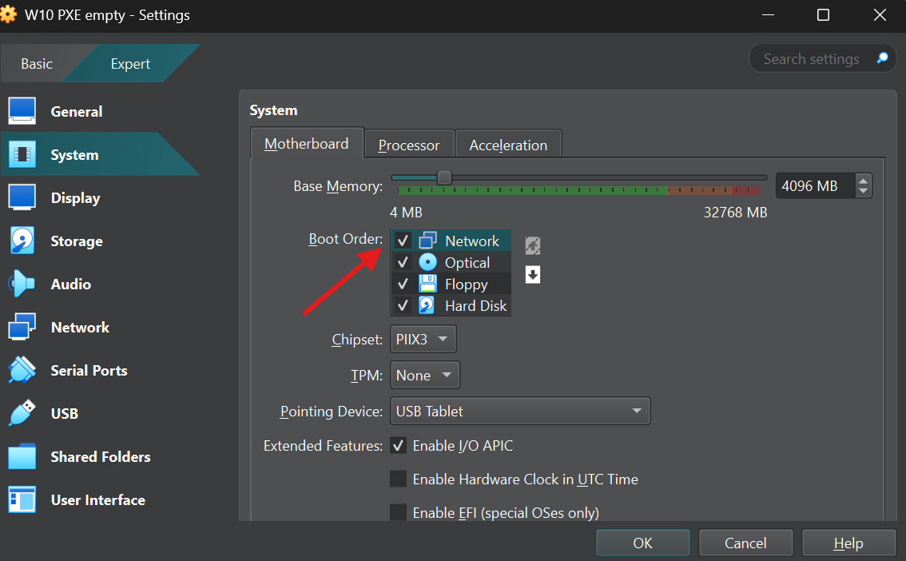
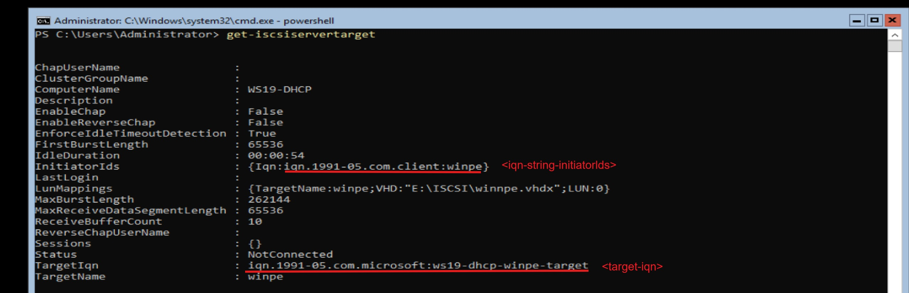

## **I. CHUẨN BỊ**

-   **Server:** Windows Server Core 2019 Datacenter Edition.
-   **Phân vùng Server:** Phân vùng chứa data tệp `.vhdx` và `winsetup` (Tối thiểu > 5GB).
-   **Công cụ:** WinPE từ Assessment and Deployment Kit (ADK) và bộ cài Windows ISO.
-   **Client:** Card mạng hỗ trợ iPXE 1.21.1+.
-   **Phần mềm ảo hóa:** VMWare hoặc VirtualBox.

---

## **II. CẤU HÌNH IP TĨNH**

Sử dụng câu lệnh:
```powershell
sconfig
```
Menu thiết lập cơ bản sẽ hiện ra:
1.  Tìm và gõ số tương ứng với dòng **“Network Settings”**.
2.  Gõ index của card mạng muốn đặt IP tĩnh.
3.  Khi được hỏi về lựa chọn DHCP hay Static, gõ `s`.
4.  Tiếp tục nhập các thông số: **IPv4**, **Subnet mask**, **Default Gateway**.



---

## **III. CÀI ĐẶT DHCP TRÊN WINDOWS SERVER 2019**

Sử dụng PowerShell và thực hiện các câu lệnh sau:
```powershell
# Cài đặt DHCP và công cụ quản lý
install-windowsfeature dhcp -includemanagementtools

# Tạo một scope mới
add-dhcpserverv4scope -name “<tên pool>” -startrange <IPv4 bắt đầu> -endrange <IPv4 cuối cùng> -subnetmask <subnet> -state active

# Thiết lập thời gian cho thuê IP
set-dhcpserverv4optionvalue -scopeid <IPv4 Network> -leaseduration <Thời gian format d.hh:mm:ss>

# Đặt tùy chọn boot qua DHCP
set-dhcpserverv4optionvalue -scopeid <IPv4 Network> -type both
```

**Ví dụ:**


---

## **IV. CÀI ĐẶT ISCSI TRÊN WINDOWS SERVER 2019**

### **1. Cài đặt tính năng iSCSI Target Server**
```powershell
Install-windowsfeature fs-iscsiTarget-Server
```

### **2. Tạo ổ đĩa ảo VHD**
```powershell
New-iscsiVirtualDisk -Path “<Địa chỉ tạo ổ ảo vhdx>” -Size <Dung lượng GB>
```

### **3. Tạo iSCSI Target**
```powershell
New-iscsiServerTarget -TargetName “<Đặt tên target>” -initiatorIds “<Tham số xác định initiator VD: ‘IQN:iqn.1991-05.com.microsoft:winpe’>”
```

### **4. Gán ổ VHD vào Target**
```powershell
Add-IscsiVirtualDiskTargetMapping -TargetName “<Tên Target>” -Path “<Địa chỉ ổ ảo vhdx đã tạo>”
```


---

## **V. ĐỊNH DẠNG PHÂN VÙNG CHO VHD**

Trên Command Prompt, thực hiện các câu lệnh sau:
```diskpart
# Mở công cụ diskpart
diskpart

# Chọn ổ đĩa ảo
select vdisk file=”<Vị trí ổ ảo vhdx> VD: ‘E:\iscsi\winpe.vdhx’”

# Mount ổ ảo
attach vdisk

# Tạo phân vùng chính
create partition primary

# Định dạng NTFS, đặt nhãn và thực hiện nhanh
format fs=ntfs quick label=winpe

# Gán ký tự cho phân vùng (ví dụ: W)
assign letter=W

# Kích hoạt phân vùng
active

# Thoát diskpart
exit
```

---

## **VI. TẢI VÀ CÀI ĐẶT MÔI TRƯỜNG WINPE (ADK)**

### **1. Tải và cài ADK**

**Cách 1: Sử dụng máy có GUI**
- Tải ADK và add-on WinPE từ trang chủ Microsoft.
- Khi cài đặt, chọn **"Deployment Tools"** và **"Windows Preinstallation Environment (Windows PE)"**.

**Cách 2: Thực hiện trên Server Core (PowerShell)**
- Tải ADK:
  ```powershell
  Invoke-WebRequest -Uri "https://go.microsoft.com/fwlink/?linkid=2288854" -OutFile <Thư mục tải về VD: "C:\users\administrator\downloads\adksetup.exe">
  ```
- Cài đặt các thành phần cần thiết:
  ```powershell
  C:\users\administrator\downloads\adksetup.exe /quiet /installpath "C:\Program Files (x86)\Windows Kits\10" /features OptionId.DeploymentTools OptionId.WindowsPreinstallationEnvironment
  ```

### **2. Tạo môi trường WinPE**
- Mở môi trường "Deployment and Imaging Tools Environment" với quyền quản trị:
  ```cmd
  cd “C:\Program Files (x86)\Windows Kits\10\Assessment and Deployment Kit\Deployment tools”
  start cmd.exe
  ```
- Trong cửa sổ cmd mới, tạo thư mục làm việc cho WinPE:
  ```cmd
  copype amd64 C:\winpe
  ```
- Thư mục `C:\winpe` sẽ được tạo ra với các thư mục con: `media`, `mount`, và `fwfiles`.


### **3. Gán WinPE và bộ cài Windows vào ổ VHD**
- Sao chép toàn bộ thư mục WinPE (`media`) vào ổ VHD đã mount (W:\):
  ```cmd
  xcopy C:\winpe\media\* W:\ /E /H /K
  ```
  - `/E`: Sao chép tất cả thư mục con.
  - `/H`: Sao chép các tệp ẩn và tệp hệ thống.
  - `/K`: Giữ nguyên thuộc tính "read-only".

- Tạo thư mục và sao chép bộ cài Windows từ file ISO đã mount (giả sử là ổ X:\) vào ổ VHD:
  ```cmd
  mkdir W:\wsetup
  xcopy X:\* W:\wsetup\ /E /H /K
  ```

---

## **VII. KIỂM TRA CẤU HÌNH SERVER**

### **1. Kiểm tra Port 3260 (iSCSI)**
- Kiểm tra xem port có đang lắng nghe không:
  ```powershell
  netstat -ano | findstr 3260
  ```
- Nếu không có kết quả, khởi động lại dịch vụ iSCSI Target:
  ```powershell
  restart-service wintarget
  ```

### **2. Kiểm tra Target iSCSI**
- Xem danh sách các ổ VHD đã tạo:
  ```powershell
  get-iscsiVirtualDisk
  ```
- Xem thông tin target và trạng thái kết nối:
  ```powershell
  get-IscsiServerTarget
  ```
  - **`not-connected`**: Target đã sẵn sàng, chưa có client kết nối.
  - **`connected`**: Client đã kết nối thành công.
  - **`error`**: Lỗi cấu hình.



### **3. Cấu hình Firewall**
- Cho phép dịch vụ iSCSI và chia sẻ file/máy in (tùy chọn):
  ```powershell
  Enable-NetFirewallRule -DisplayGroup "iSCSI Service"
  Enable-NetFirewallRule -DisplayGroup "File and Printer Sharing"
  ```

---

## **VIII. THỰC HIỆN BOOT TRÊN CLIENT**

1.  **Thiết lập BIOS/UEFI:** Đảm bảo Client được ưu tiên boot qua mạng (Network Boot/PXE) và dùng chung mạng với Server.



2.  **Khởi động iPXE:** Khi Client khởi động, môi trường iPXE sẽ tự động chạy.
3.  **Thực hiện các lệnh trong iPXE:**
    ```ipxe
    # Nhận IP từ DHCP server
    dhcp

    # Đặt initiator IQN để khớp với cấu hình trên server
    set initiator-iqn <iqn-string-initiatorIds>

    # Boot vào ổ VHD từ iSCSI target
    sanboot iscsi:<IPv4 ISCSI server>::::<target-iqn>
    ```
    - *Lưu ý: Lấy thông tin `<iqn-string-initiatorIds>` và `<target-iqn>` từ lệnh `get-iscsiservertarget` trên Server.*



**Màn hình iPXE trên client:**


4.  **Khởi động bộ cài Windows từ WinPE:**
    - Sau khi boot vào WinPE thành công, ổ VHD sẽ được nhận như một ổ đĩa vật lý (thường là C:\).
    - Mở Command Prompt và thực hiện:
      ```cmd
      # Chuyển đến ổ đĩa chứa bộ cài (thường là C:)
      C:
      
      # Di chuyển vào thư mục chứa bộ cài đã sao chép
      cd wsetup
      
      # Chạy file cài đặt
      setup.exe
      ```
