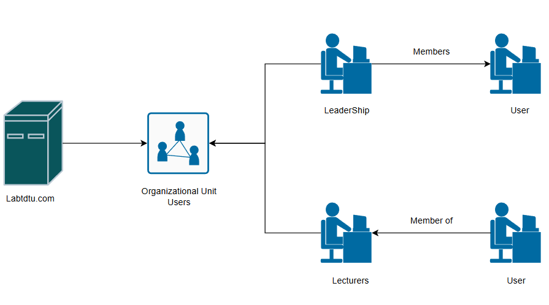

# Cấu hình OU và GroupUsers

### **Mục tiêu**

- Tạo ra các User đăng nhập vào domain labtdtu.com
- Tạo nhóm và phân nhóm cho user vào các nhóm vai trò thích hợp trên domain labtdtu.com
- Lập lịch và kiểm soát đăng nhập của các User trong domain labtdtu.com

### Yêu cầu

- Các thiết bị cùng chung network
- Máy chủ Windows Server 2019 có cài đặt chức năng Active Directory (FIT-DC-02)
- Một máy client kiểm thử kết nối



### **Bước 1: Tạo User trên Active Directory**

Nếu máy chưa cặt đặt gói cho AD, hãy thực hiện 

```powershell
 Get-Module -ListAvailable ActiveDirectory
```

Trước khi tạo user gia nhập domain, mặc định khi cài đặt chức năng AD sẽ tạo sẵn một số OU trong đó có Users, nhưng nếu chưa được tạo trên domain controller FIT-DC-02 ta sẽ thực tạo ra OU để quản lý nhóm, user qua Powershell:

```powershell
New-ADOrganizationalUnit -Name "FIT" -Path "DC=labtdtu, DC=com"

#Kiem tra ket qua tao OU
Get-ADOrganizationalUnit -Filter * | Select-Object Name, DistinguishedName
```

Thực hiện tạo user cho miền [Labtdtu.com](http://Labtdtu.com) thông qua Cmdlet Powershell sau:

```powershell
#Tao user giang vien Le Viet Thanh
New-ADUser -Name "Thanh Le Viet" -GivenName "Thanh" -SurName "Le Viet" -SamAccountName "thanhlv" -Path "OU=FIT,DC=labtdtu,DC=com" -AccountPassword (ConvertTo-SecureString "P@ssw0rd" -AsPlainText -Force) -Enable $true  

#Kiem tra ket qua sau khi tao User
Get-ADUser -Identity "thanhlv"
```

Riêng tài khoản tintt và tinpt cần thay đổi mật khẩu sau lần đăng nhập đầu tiên

```powershell
#Tao user va buoc thay doi mat khau
New-ADUser `
-Name "Tin Tran Trung" -GivenName "Tin" -Surname "Tran Trung" `
-SamAccountName "tintt" -Path "OU=Users,DC=labtdtu,DC=com" `
-AccountPassword (ConvertTo-SecureString "P@ssw0rd" -AsPlainText -Force) `
-Enabled $true `
-ChangePasswordAtLogon $true #Buoc thay doi mat khau
```

Làm tương tự với các user còn lại theo bảng sau:


### **Bước 2: Tạo Group và thêm User trên Active Directory**

Ta cần tạo ra hai nhóm vai trò gồm Lecturers và LeaderShip cùng thuộc OU Users trên miền domain và thêm các user thích hợp vào từng nhóm theo yêu cầu. Cách thức để tạo và tham gia nhóm bằng PowerShell như sau

| Loại nhóm | Mục đích chính | Có thể phân quyền? |
| --- | --- | --- |
| **Security Group** | Quản lý quyền truy cập, bảo mật | ✅ Có |
| **Distribution Group** | Gửi email nhóm (Exchange, Outlook) | ❌ Không |

```powershell
#Tao group Lecturers tren Active Directory
 New-ADGroup -Name "Lecturers" -GroupScope Global -GroupCategory Security -Path "OU=FIT,DC=labtdtu,DC=com"  

#Them user thanhlv vao group Lecturers
Add-ADGroupMember -identity "Lecturers" -Members "thanhlv"

#Lam tuong tu voi group LeaderShip va cac user khac
...
...
...

#Kiem tra sau khi thiet lap
Get-ADGroupMember -Identity "Lecturers" #Hien thi tat ca thanh vien trong nhom Lecturers
```

Khi cài đặt Windows Server và chức năng Active Directory. Trên hệ điều hành sẽ cấu hình sẵn một số nhóm được thực hiện chức năng cụ thể theo vai trò trên hệ thống. Điển hình đó là cho phép hoặc hạn chế một số quyền hạn thực hiện các tác vụ trên máy chủ và máy trạm. Một số nhóm tạo phổ biến trong domain có thể kể đến:

- Domain Admins: Các thành viên thuộc nhóm này sẽ toàn quyền quản trị như Administrator trong domain
- Domain Users: Mặc định sau khi tạo tài khoản trên Active Directory với các quyền của người dùng cơ bản

Để biết chính xác có tất cả bao nhiêu nhóm đã được tạo trên hệ thống ta thực hiện cmdlet Powershell sau:

```powershell
#Hien thi danh sach tat ca cac nhom co tren he thong may chu domain 
Get-ADGroup -Filter *
```

Trong yêu cầu sẽ thêm tất cả thành viên vừa tạo vào nhóm có tên “Backup Operators”, đây là nhóm được tạo sẵn trong Windows Server để các quyền hạn về backup và khôi phục dữ liệu của hệ thống.

```powershell
#Them user vao group Backup Operators
Add-ADGroupMember -identity "Backup Operators" -Members "thanhlv"

# ( Hoac ) thuc hien vong lap

$lecs = Get-ADGroupMember -Identity "Lecturers" -Recursive 
$leads = Get-ADGroupMember -Identity "LeaderShip" -Recursive 
foreach ($lec in $lecs) {Add-ADGroupMember -identity "Backup Operators" -Member $lec.SamAccountName}
foreach ($lead in $leads) {Add-ADGroupMember -identity "Backup Operators" -Member $lead.SamAccountName}

#Thuc hien kiem tra
Get-ADGroupMember -Identity "Backup Operator"
```

### Bước 3: Cấu hình đăng nhập

- Tài khoản tutd và huynv tạm khóa và phải đổi mật khẩu ở máy trạm

```powershell
# Khi di cong tac
Disable-ADAccount -Identity tutd #Vo hieu hoa tai khoan
# Sau khi tro ve
Enable-ADAccount -Identity tutd #Tai kich hoat tai khoan
Set-ADUser -Identity tdtd -ChangePasswordAtLogon $true #Yeu cau dat lai mat khau

#Lam tuong tu voi huynv
```

- Tài khoản namtt không được phép đổi mật khẩu ở máy trạm

```powershell
Set-ADUser -Identity namtt -CannotChangePassword $true #Ngan chan doi mat khau
```

- Tài khoản thanhlv hết hạn đăng nhập vào ngày 10/10/2025

```powershell
Set-ADUser -Identity thanhlv -AccountExpirationDate "10/10/2025"
```

- Sau khi thiết lập các cấu hình cần thiết cho yêu cầu ta có thể kiểm tra trạng thái của tài khoản đã được thiết lập thành công hay không.

```powershell
Get-ADUser -Identity thanhlv -Properties * #Show tat ca thong tin cua tai khoan user ke ca thong tin vua thiet lap

#Tuong tu voi tai khoan namtt, tutd va huynv
```

### Bước 4: Lập lịch thời gian đăng nhập cho các giảng viên

Giảng viên chỉ được phép đăng nhập vào máy trạm của miền trong  khoảng thời gian từ 7h → 5h chiều từ thứ 2 → thứ 7 để đảm bảo truy cập luôn được kiểm soát và ngăn chặn, phát hiện kịp thời những xâm nhập ngoài thời gian quy định có thể gây nguy hại đến an toàn thông tin nội bộ. Để cấu hình thời gian truy cập, ta sẽ sử dụng cmdlet từ Powershell kết hợp Command Prompt.

```powershell
#Su dung command prompt cho tung user
net user thanhlv /times:M-Sa,07:00-17:00 /domain

#( Hoac ) Su dung vong lap de thiet lap tat ca thanh vien trong nhom giang vien

$user = Get-ADGroupMember -Identity "Lecturers" -Recursive 
foreach ($user in $users) { Invoke-Expression "net user $($user.SamAccountName) /times:M-Sa,07:00-17:00 /domain" }" }

#Kiem tra sau khi thuc hien bang command prompt
net user <ten user>
```

Trong đó: 

- Định dạng của các ngày trong tuần: M, T, W, Th, F, Sa, Su lần lượt là thứ 2 → 7
- Định dạng thời gian trong ngày: <Thời gian bắt đầu> → <Thời gian kết thúc> theo dạng hh:mm:ss

### Bước 5: Kiểm tra trên máy trạm Client

- Khởi động máy trạm đã gia nhập vào domain thành công
- Trên giao diện đăng nhập, chọn “Other user” phía dưới góc trái và thử đăng nhập bằng Domain\SamAccountName, Password đã được thiết lập khi tạo user trên Active Directory.
VD: Tài khoản thanhlv sẽ có tên đăng nhập là Labtdtu.com\thanhlv và password là P@ssw0rd
- Thử lần lượt với các tài khoản còn lại theo từng kịch bản thời gian khác nhau và quan sát kết quả