# Cài đặt và cấu hình dịch vụ DHCP

# 1. MỤC TIÊU

- Cài đặt vai trò DHCP, ủy quyền DHCP trên Active Directory, tạo scope (phạm vi) dãy các IP động, và loại trừ (Exclusion) dãy IP cho mục đích cấp phát tĩnh.
- Cài đặt các DHCP option: DNS Server, Default (Gateway) Router.
- Tạo bản Backup dữ liệu DHCP Server.
- Tạo Zone và bảng ghi cho dịch vụ DNS (A, PTR, CName, MX…).

# 2. CHUẨN BỊ

- Khởi động 2 Máy chủ Windows Server: FIT-DC-02 và FIT-SDC-04 (Optional).
- Khởi động 1 Máy trạm Windows: FIT-WIN10-01.
- Chung một mạng Host và không bị tác động bởi dịch vụ DHCP của ISP.
- Trên phần mềm ảo hóa VMWare: Sử dụng chế độ mạng Host-Only, VMnet Host-Only (Hoặc Internal network đối với VirtualBox) và tắt phân phối DHCP từ thiết bị thật.

# 3. SƠ ĐỒ MẠNG

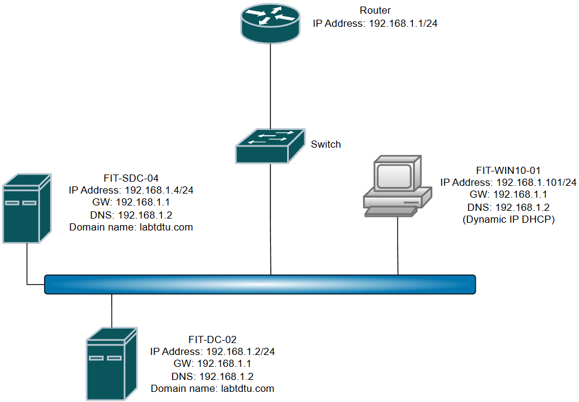

# 4. HƯỚNG DẪN CÀI ĐẶT

## CẤU HÌNH DHCP SERVER

### Bước 1: Cài đặt vai trò DHCP và ủy quyền vào AD

- Trên máy chủ FIT-DC-02 ta thực hiện câu lệnh PowerShell sau để tiến hành cài đặt.

```powershell
Install-WindowsFeature DHCP -IncludeManagementTools

#Kiem tra trang thai cai dat
Get-WindowsFeature DHCP
```

- Sau khi vai trò được cài đặt ta sẽ ủy quyền DHCP Server vào miền AD Domain labtdtu.com

```powershell
Add-DHCPServerInDC -DNSName "FIT-DC-02.labtdtu.com" -IPAddress 192.168.1.2

#Kiem tra ket qua uy quyen
Get-DHCPServerInDC
```


### Bước 2: Cấu hình Scope IP, Loại trừ IP và các option DHCP

- Trước hết ta sẽ tạo ra một scope cho máy chủ DHCP bằng câu lệnh Powershell

```powershell
Add-DHCPServerv4Scope -Name "LAN_A" -Description "DHCP phan phoi IP cho LAN_A" -StartRange 192.168.1.1 -EndRange 192.168.1.254 -SubnetMask 255.255.255.0 -LeaseDuration 8.00:00:00

#Kiem tra scope DHCP (Lay ScopeId)
Get-DHCPServerv4Scope
```

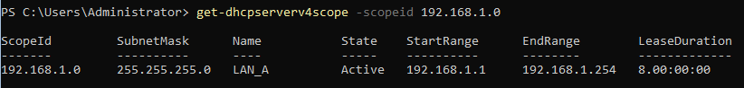

- Loại trừ các IP cho mục đích cấu hình tĩnh

```powershell
Add-DHCPServerv4ExclusionRange -ScopeId 192.168.1.0 -StartRange 192.168.1.1 -EndRange 192.168.1.100

#Kiem tra danh sach loai tru
Get-DHCPServerv4ExclusionRange -ScopeId 192.168.1.0
```


- Thêm các cấu hình option vào DHCP Scope

```powershell
#Cau hinh option DNSServer, DNS Domain Name va Default Gateway
Set-DHCPServerv4OptionValue -ScopeId 192.168.1.0 -Option 6 -Value 192.168.1.2
Set-DHCPServerv4OptionValue -ScopeId 192.168.1.0 -Option 3 -Value 192.168.1.1
Set-DHCPServerv4OptionValue -ScopeId 192.168.1.0 -Option 15 -Value "labtdtu.com"

#Kiem tra cau hinh Option
Get-DHCPServerv4OptionValue -Scopeid 192.168.1.0
```

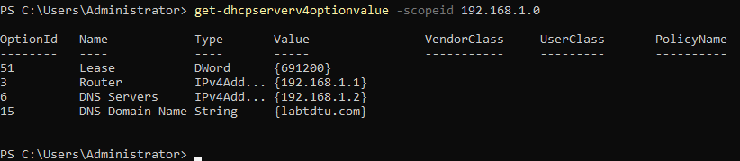

### Bước 3: Kiểm tra cấp phát động trên máy trạm

- Trên máy trạm FIT-WIN10-01 đăng nhập bằng tài khoản domain user hợp lệ
- Cách 1: Trên giao diện GUI nhấn tổ hợp phím Win + R → Nhập “control” → Click chọn “Network and Internet” → Network and Sharing center → “Change adapter settings” góc trái → Chọn và click vào card mạng tương ứng muốn cấp IP động DHCP → Properties → Nhấp vào tùy chọn “Internet Protocol Version 4” và nhấn vào nút “Properties” → Chuyển chế độ tĩnh của cấp phát IP và DNS sang động

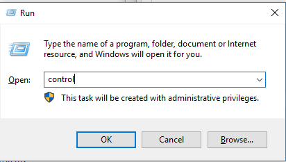

                             

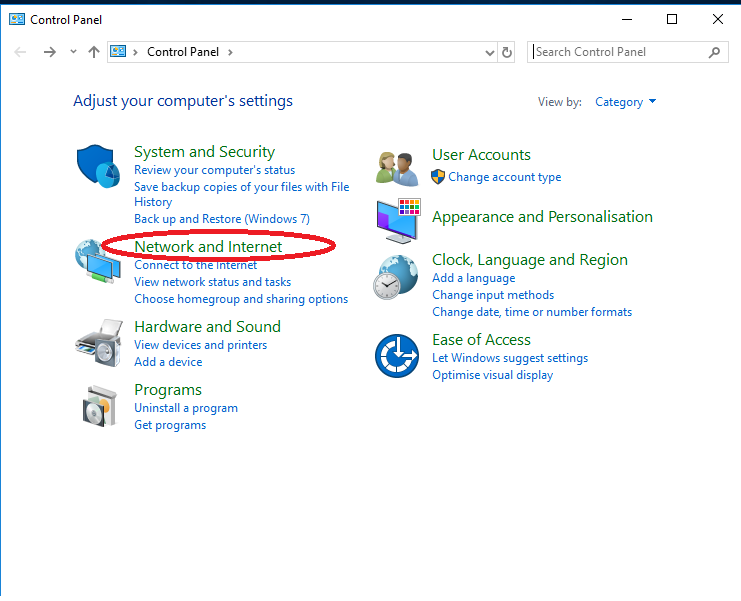

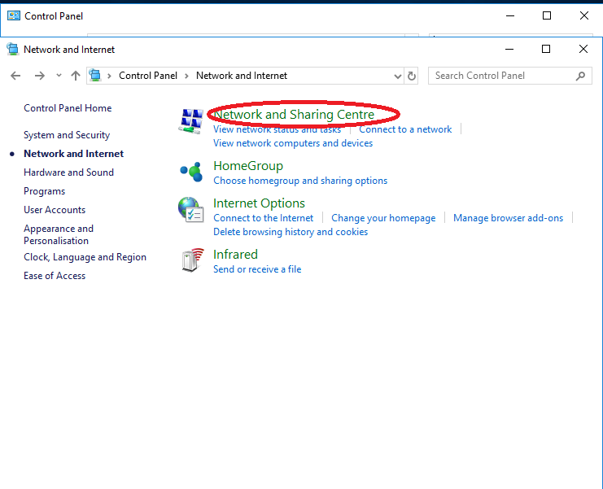

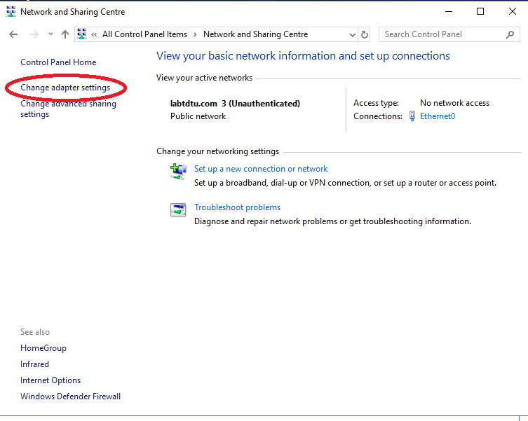

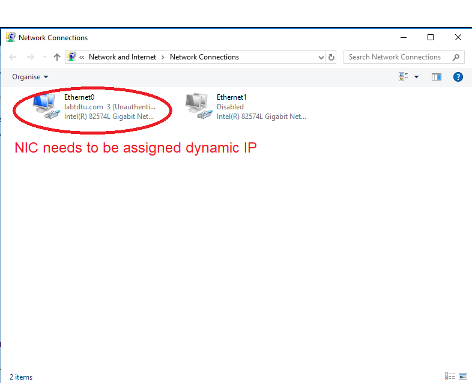

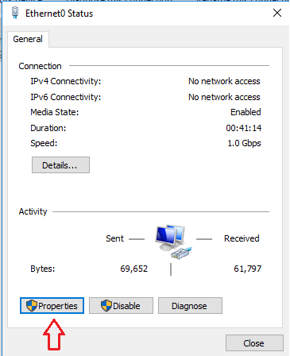

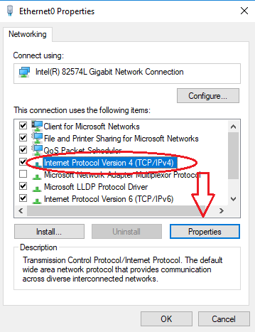


- Cách 2: Trên giao diện CLI thực hiện câu lệnh tìm ip động

```powershell
#Hien thi danh sach card mang de xac dinh interface phu hop
Get-NetIPInterface

#Sau khi xac dinh NIC interface can chuyen sang DHCP vi du Ethernet0
#Xoa IP tren card
Remove-NetIPAddress -InterfaceAlias "Ethernet0" -confirm:$false

#Chuyen sang DHCP
Set-NetIPInterface -InterfaceAlias "Ethernet0" -AddressFamily IPv4 -DHCP Enabled
Set-DnsClientServerAddress -InterfaceAlias "Ethernet0" -ResetServerAddresses

cmd
ipconfig /renew "Ethernet0"
```

- Sau khi cấu hình IP động cho máy trạm FIT-WIN10-01, ta sẽ kiểm tra trạng thái nhận IP của Card mạng bằng GUI hoặc cmd như sau

```powershell
ipconfig /all
```


Kiểm tra trạng thái bằng GUI


Kiểm tra trạng thái bằng Command Prompt

## TẠO BACKUP DHCP SERVER

### Bước 1: Tạo thư mục lưu trữ bản backup

Trên máy chủ DHCP “FIT-DC-02” thực hiện tạo một thư mục “BACKUP DHCP SERVER” tại phân vùng C:\

```powershell
cd C:\
mkdir "BACKUP DHCP SERVER"

#Kiem tra thu muc
dir "C:\"
```

### Bước 2: Tạo bản backup DHCP

- Ta sẽ tiến hành tạo ra bản backup DHCP và lưu vào thư mục vừa tạo bằng dòng lệnh Powershell

```powershell
Backup-DHCPServer -ComputerName 192.168.1.2 -Path "C:\BACKUP DHCP SERVER"
```

- Sau khi tạo thành công sẽ xuất hiện thư mục “new” và tệp cấu hình “DhcpCfg” trong thư mục được chọn để lưu trữ. Ta có thể kiểm tra bằng cách

```powershell
dir "C:\BACKUP DHCP SERVER"
```

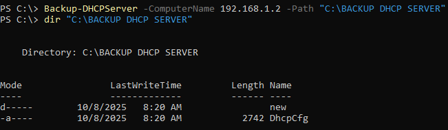

### Bước 3: Tạo trường hợp giả định backup DHCP Server

- Trên FIT-DC-02 ta sẽ xóa scope của dịch vụ DHCP để giả định lỗi xảy ra khiến máy trạm không thể nhận được IP động

```powershell
Remove-DHCPServerv4Scope -ScopeId 192.168.1.0 -Force

#Kiem tra xem Scope da duoc xoa hay chua
Get-DHCPServerv4Scope
```

- Sau khi xác nhận Scope đã được xóa, trên cmd máy trạm FIT-WIN10-01 ta sẽ thực hiện cấp lại IP động. Nếu sau khi gõ xong câu lệnh mà không có phản hồi nào nghĩa là giả định lỗi thành công.

```powershell
ipconfig /release
ipconfig /renew

#Ipconfig /renew se khong phan hoi ket qua thanh cong cap IP dong
```

- Quay lại FIT-DC-02 ta sẽ tiến hành khôi phục lại dữ liệu DHCP Scope bị xóa bằng dữ liệu backup đã được tạo và lưu trữ trước đó

```powershell
#Thuc hien khoi phuc
Restore-DHCPServer -ComputerName 192.168.1.2 -Path "C:\BACKUP DHCP SERVER"

#Khoi dong lai dich vu DHCP Server
Restart-Service DHCPServer
```

- Sau khi khôi phục thành công, ta sẽ kiểm tra dữ liệu Scope để xem dữ liệu Scope bị xóa đã tồn tại lại hay chưa

```powershell
Get-DHCPServerv4Scope
```

- Trên máy trạm FIT-WIN10-01 ta thực hiện lệnh “ipconfig /renew” một lần nửa và lần này DHCP Server phải cấp thành công IP động cho máy trạm

## TẠO CÁC BẢN GHI DNS

### Bước 1: Tạo bản ghi A phân giải tên miền

- Khi cấu hình Domain Controller ở các buổi trước, ta đã tạo ra một primary zone có tên là “labtdtu.com” trên dịch vụ DNS ở FIT-DC-02
- Trong zone này ta sẽ kiểm tra xem các bản ghi A dùng cho Forward Lookup bằng PowerShell

```powershell
Get-DNSServerResourceRecord -ZoneName "labtdtu.com" | Where-object {$_.RecordType -eq "A"}
```

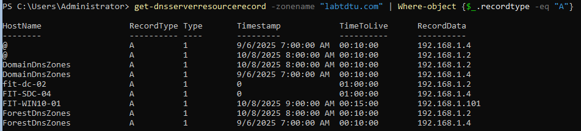

- Nếu như có các bản ghi A chưa được tạo cho các thiết bị cần thiết (Ví dụ: Máy tính trạm, các máy chủ trong miền…) thì ta sẽ tiến hành tạo như sau:
    - Đối với các thiết bị cần phân giải tên miền sang IP cố định như máy chủ
    
    ```powershell
    Add-DnsServerResourceRecordA -Name "<Ten-host>" -ZoneName "<Ten-Zone>" -IPv4Address "<IPv4>" -TimeToLive hh:mm:ss
    
    #Vi du ban ghi A cho FIT-SDC-04
    Add-DnsServerResourceRecordA -Name "FIT-SDC-04" -ZoneName "labtdtu.com" -IPv4Address "192.168.1.4" -TimeToLive 01:00:00
    
    ```
    
    - Đối với các thiết bị cần phân giải tên miền sang IP được cấp phát động như máy trạm
    
    ```powershell
    Set-DHCPServerv4DNSSetting -ComputerName "192.168.1.2" -DynamicUpdates "Always"
    
    #Tren cac may tram thuc hien cap phat lai IP dong
    ipconfig /release
    ipconfig /renew
    ```
    

### Bước 2: Tạo bản ghi PTR phân giải ngược sang tên miền

- Để tạo ra bản ghi ngược PTR, ta cần tạo ra một zone riêng gọi là Reverse Lookup Zone

```powershell
Add-DNSServerPrimaryZone -NetworkId "192.168.1.0/24" -ZoneFile "192.168.1.rev"
```

- Sau khi tạo zone, ta sẽ tạo bản ghi PTR cho máy chủ FIT-DC-02

```powershell
Add-DNSServerResourceRecordPTR -Name "2" -ZoneName "1.168.192.in-addr.arpa" -PTRDomainName "FIT-DC-02.labtdtu.com" -TimeToLive 01:00:00
```

### Bước 3: Tạo bản ghi CNAME

Ta sẽ tạo ra một bí danh (Alias) khác để truy cập tới tên miền labtdtu.com là [www.labtdtu.com](http://www.labtdtu.com) bằng bản ghi CNAME

```powershell
Add-DNSServerResourceRecordCName -Name "www" -HostNameAlias "labtdtu.com" -ZoneName "labtdtu.com"
```

### Bước 4: Tạo bản ghi mail MX

Ta sẽ tạo ra bản ghi MX (Mail Exchange) để xử lý tên miền (Phía sau @ trong email) của các người dùng trong domain

```powershell
Add-DNSServerResourceRecordMX -ZoneName "labtdtu.com" -MailExchange "mail.labtdtu.com" -Name "mail" -Preference 10
```

### Bước 5: Kiểm tra các bản ghi đã tạo

- Câu lệnh sau sẽ hiển thị tất cả các bản ghi trong một ZoneName bao gồm các bản ghi A, PTR, CName, MX đã tạo

```powershell
Get-DNSServerResourceRecord -ZoneName "labtdtu.com"
Get-DNSServerResourceRecord -ZoneName 1.168.192.in-addr.arpa
```

- Trên máy trạm FIT-WIN10-01, ta sẽ sử dụng công cụ truy vấn tên miền có sẵn trên cmd là nslookup và tiến hành kiểm tra từng bản ghi đã tạo theo danh sách như sau
    - Bản ghi A: FIT-DC-02, FIT-WIN10-01
    - Bản ghi PTR: 192.168.1.2 (Hoặc 192.168.1.4 nếu có PTR cho FIT-SDC-04)
    - Bản ghi MX: mail
    - Bản ghi CName: www hoặc www.labtdtu.com

```powershell
nslookup
> 192.168.1.4
> fit-dc-02
> fit-win10-01
> www
> mail
```

- Sau khi truy vấn từng bản ghi thì kết quả sẽ hiển thị như hình sau
    
    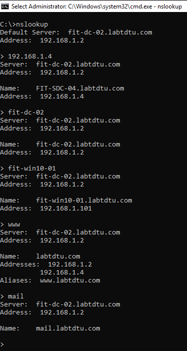
    

## TẠO DHCP dự phòng hoặc song song

Thực hiện cài đặt trên FIT-DC-02:

```jsx
Add-DhcpServerv4Failover `
  -ComputerName "FIT-DC-02" `
  -Name "DHCP replica" `
  -PartnerServer "FIT-SDC-04" `
  -ScopeId 192.168.1.0 `
  -SharedSecret "P@ssw0rd" `
  -MaxClientLeadTime 1:00:00 `
  -LoadBalancePercent 50
```

Thực hiện các đặt trên FIT-SDC-04 → chỉ cần:

1. Cài role **DHCP Server**.
2. Start dịch vụ DHCP.
3. Authorize trong AD.
4. Mở firewall cho RPC/WMI và DHCP.
→ Không cần tạo scope thủ công, vì đã chạy lệnh trên FIT‑DC‑02, cấu hình sẽ tự replicate sang FIT‑SDC‑04.