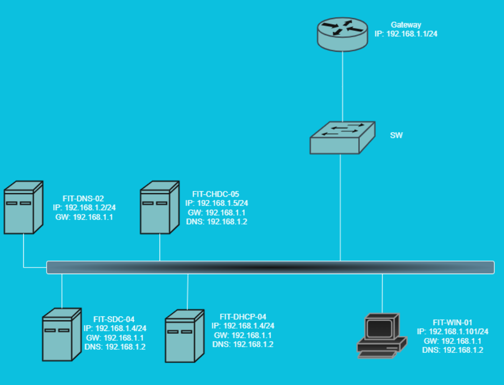
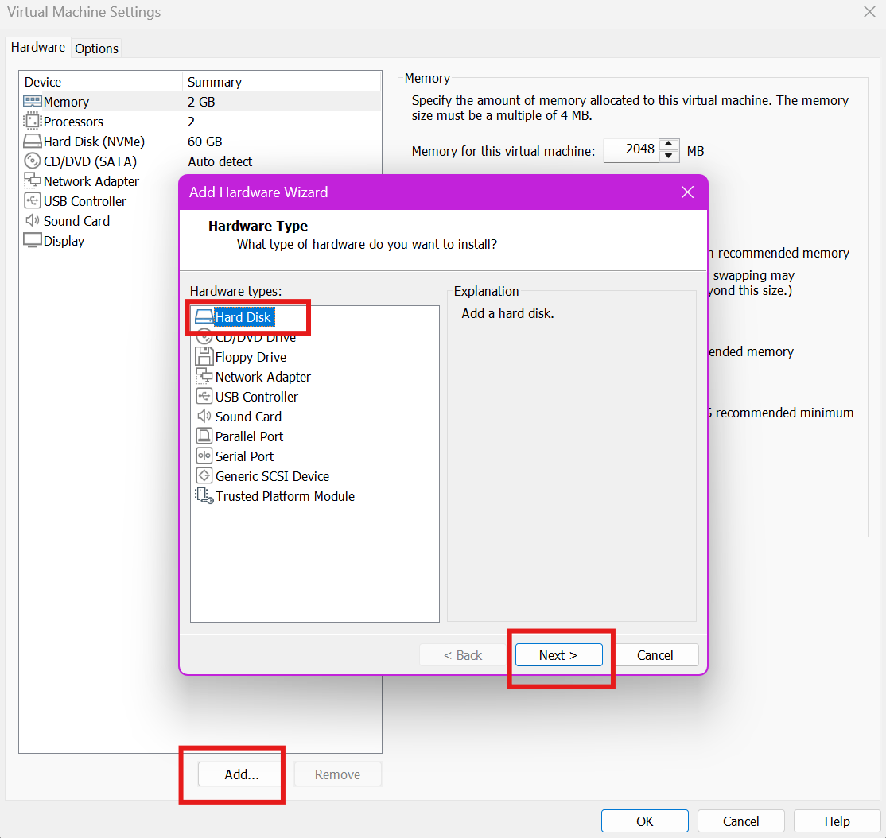
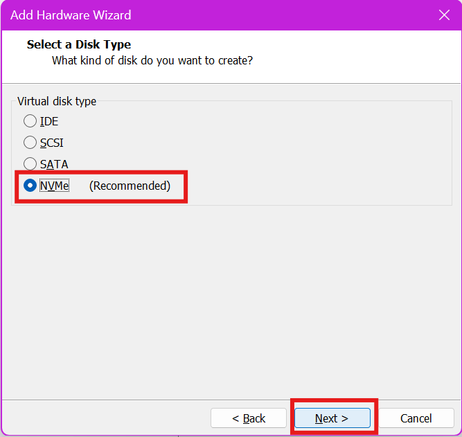
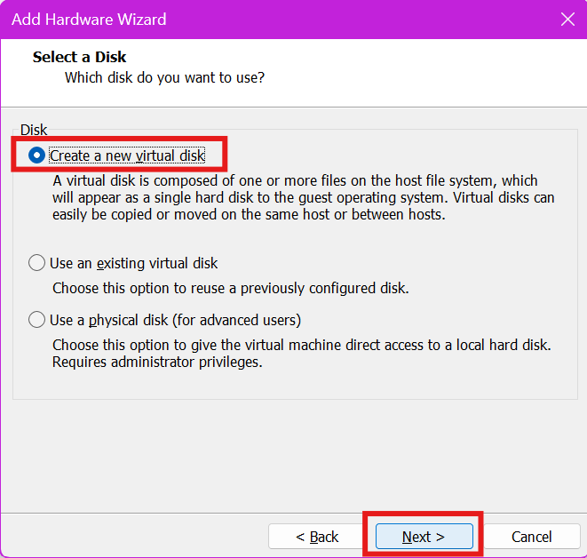
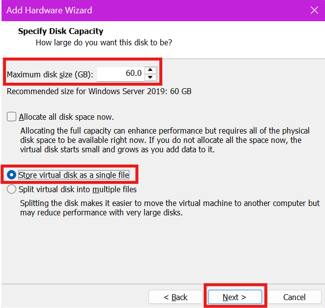
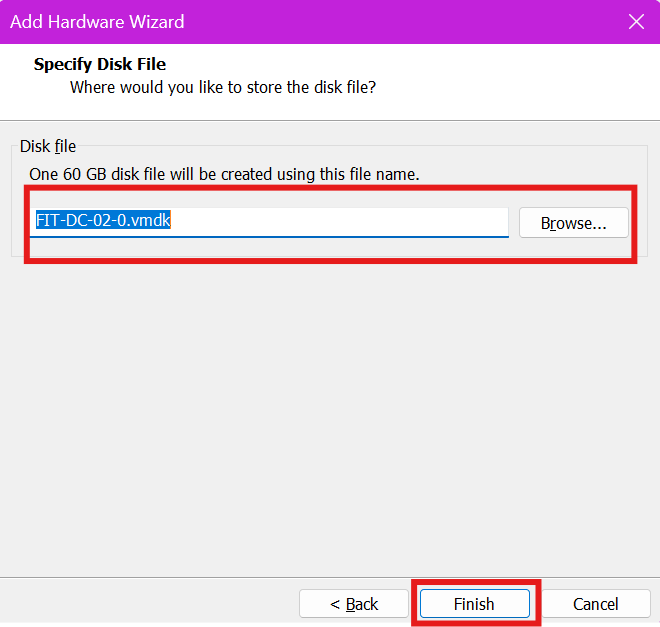
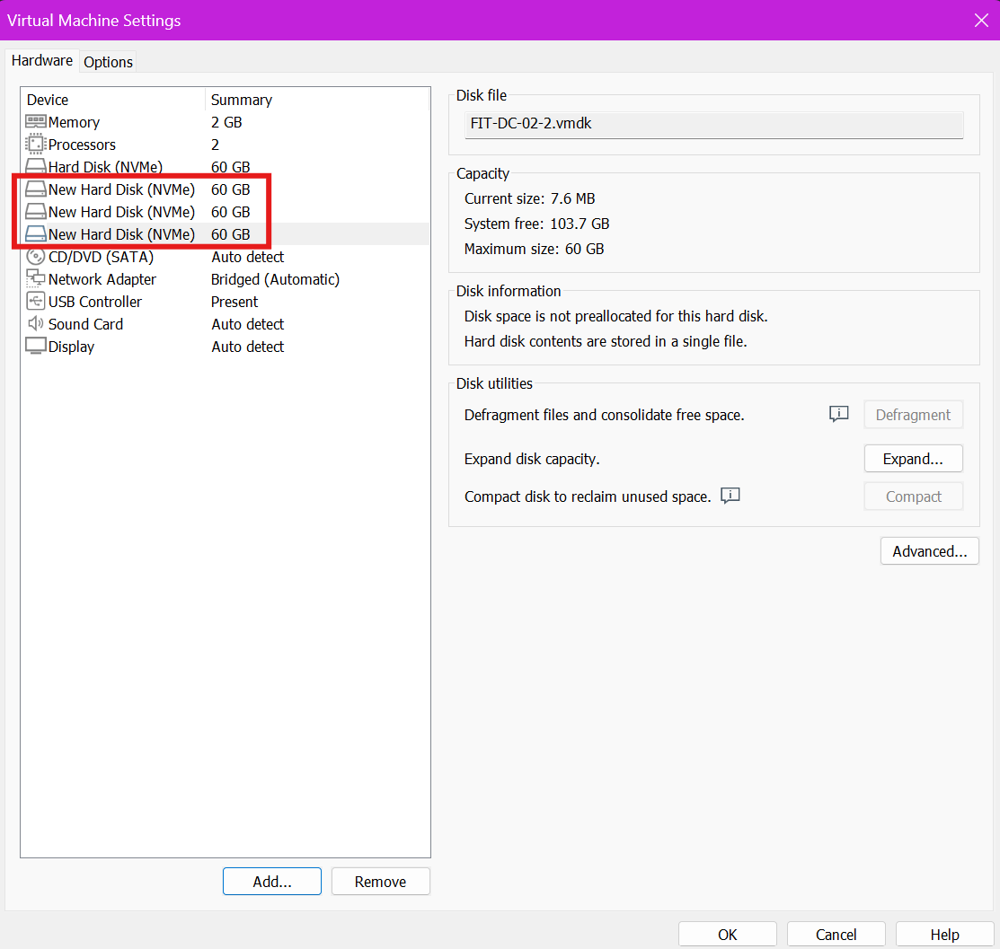

# Cài đặt và cấu hình quản lý đĩa

# 1. Mục tiêu

Cấu hình và quản lý RAID trên **labtdtu.com** theo hai kiểu phân vùng: **MBR** và **GPT**.

**Cấu hình theo kiểu Master Boot Record (MBR):**
– Kiểu Basic: Tạo 3 Primary Partition, 1 Extended Partition.
– Kiểu Dinamic : Mirrored Volume, Striped Volume, Spanned volume.

**Cấu hình theo kiểu GUID Partition Table ( GPT ):**
– Tạo các Primary Partition.

### 1.1. Các Khái niệm Nền tảng (MBR vs GPT)

Trước khi vào các phân vùng, cần phân biệt hai kiểu "bảng quy hoạch" tổng của ổ đĩa.

- **Master Boot Record (MBR):**
    - **Định nghĩa:** Là một tiêu chuẩn cũ (legacy) để quản lý các phân vùng trên ổ đĩa. Nó chứa một đoạn mã nhỏ (boot loader) để khởi động hệ điều hành và một "bảng phân vùng" (partition table) để mô tả các phân vùng.
    - **Đặc điểm:** Bị giới hạn ở 4 phân vùng chính (hoặc 3 chính + 1 mở rộng). Chỉ hỗ trợ các ổ đĩa có dung lượng tối đa 2TB.
- **GUID Partition Table (GPT):**
    - **Định nghĩa:** Là một tiêu chuẩn mới, hiện đại, thay thế cho MBR. Nó sử dụng các mã nhận dạng duy nhất toàn cục (GUID) để định nghĩa các phân vùng.
    - **Đặc điểm:** Hỗ trợ ổ đĩa lớn hơn 2TB (gần như không giới hạn). Hỗ trợ tối đa 128 phân vùng trên Windows. An toàn và linh hoạt hơn MBR.

---

### 1.2. Các Loại Đĩa (Basic vs Dynamic)

Sau khi chọn MBR hay GPT, chọn "kiểu" đĩa sẽ hoạt động:

- **Basic Disk (Đĩa Cơ bản):**
    - **Định nghĩa:** Là loại đĩa tiêu chuẩn, phổ biến nhất trên Windows. Nó sử dụng các phân vùng cố định (Primary, Extended, Logical). Đây là kiểu thường dùng để cài Windows và lưu dữ liệu.
- **Dynamic Disk (Đĩa Động):**
    - **Định nghĩa:** Là một loại cấu hình đĩa nâng cao của Windows. Nó không dùng "phân vùng" mà dùng "volume".
    - **Đặc điểm:** Tính năng chính của nó là cho phép các *volume* có thể thay đổi kích thước hoặc thậm chí trải dài trên *nhiều ổ đĩa vật lý* (ví dụ: gộp 2 ổ cứng 500GB thành một ổ 1TB).

---

### 1.3. Cấu hình Kiểu MBR (trên Đĩa Basic)

Vì MBR giới hạn 4 phân vùng, người ta đã "lách luật" bằng cách sau:

- **Primary Partition (Phân vùng Chính):**
    - **Định nghĩa:** Là phân vùng "cấp 1". Đây là loại phân vùng mà có thể cài đặt hệ điều hành (như Windows) lên đó. Nó có thể được đánh dấu là "Active" (có khả năng khởi động).
    - **Giới hạn:** Một đĩa MBR chỉ có thể có **tối đa 4** phân vùng Primary.
- **Extended Partition (Phân vùng Mở rộng):**
    - **Định nghĩa:** Đây là một kiểu "container" (thùng chứa) đặc biệt. Nó *không thể* dùng để chứa dữ liệu trực tiếp và *không thể* định dạng (format) nó.
    - **Mục đích:** Mục đích duy nhất của nó là để *chứa* các Logical Drive bên trong. Nó được tạo ra để vượt qua giới hạn 4 phân vùng của MBR.
    - **Giới hạn:** Một đĩa MBR chỉ có thể có **tối đa 1** phân vùng Extended. (Vì vậy, kịch bản phổ biến là 3 Primary + 1 Extended).
- **Logical Drive (Ổ đĩa Logic):**
    - **Định nghĩa:** Là một phân vùng nằm *bên trong* Extended Partition.
    - **Mục đích:** Đây mới là nơi thực sự lưu trữ dữ liệu (ví dụ: ổ D:, E:, F:...). Có thể tạo nhiều ổ đĩa Logic bên trong một phân vùng Extended.

> Tóm tắt MBR: có 3 phân vùng Primary (ví dụ: C:, D:, E:). Sau đó, tạo 1 phân vùng Extended (chiếm hết phần còn lại). Bên trong Extended đó, tạo thêm các ổ Logic (F:, G:, H:...).
> 

---

### 1.4. Cấu hình Kiểu GPT (trên Đĩa Basic)

- **Primary Partition (trên GPT):**
    - **Định nghĩa:** Với GPT, mọi thứ đơn giản hơn. Không còn khái niệm Extended hay Logical. **Mọi phân vùng tạo đều là Primary Partition.**
    - **Đặc điểm:** chỉ cần tạo phân vùng (New Simple Volume) và nó sẽ là Primary. Có thể tạo đến 128 phân vùng như vậy.

---

### 1.5. Cấu hình Kiểu Dynamic (Đĩa Động)

Đây là các "volume" tạo sau khi đã chuyển đĩa sang dạng Dynamic.

- **Spanned Volume (Volume Nối tiếp):**
    - **Định nghĩa:** Gộp các vùng trống từ **nhiều ổ đĩa vật lý** thành một volume lớn duy nhất.
    - **Cách hoạt động:** Dữ liệu sẽ được ghi đầy ổ đĩa 1, sau đó mới ghi tiếp sang ổ đĩa 2. (Ví dụ: 100GB từ đĩa 1 + 200GB từ đĩa 2 = 1 Volume 300GB).
    - **Mục đích:** Tận dụng tối đa dung lượng.
    - **Rủi ro:** **Rất cao.** Nếu 1 trong các đĩa hỏng, sẽ **mất toàn bộ** dữ liệu của cả volume.
- **Striped Volume (Volume Phân vạch / Tương tự RAID 0):**
    - **Định nghĩa:** Gộp các vùng trống (có kích thước bằng nhau) từ 2 hoặc nhiều đĩa.
    - **Cách hoạt động:** Dữ liệu được *chia nhỏ* và ghi *đồng thời* lên tất cả các đĩa. (Ví dụ: một file 10MB sẽ được chia ra, 5MB ghi vào đĩa 1 và 5MB ghi vào đĩa 2 *cùng lúc*).
    - **Mục đích:** Tăng **tốc độ** đọc/ghi (Performance).
    - **Rủi ro:** **Cực kỳ cao.** 1 đĩa hỏng là **mất hết** dữ liệu.
- **Mirrored Volume (Volume Phản chiếu / Tương tự RAID 1):**
    - **Định nghĩa:** Cần *đúng 2 đĩa*. Mọi dữ liệu ghi vào đĩa 1 sẽ được *tự động sao chép y hệt* (mirror) sang đĩa 2.
    - **Mục đích:** **An toàn dữ liệu** (Fault Tolerance / Redundancy).
    - **Đặc điểm:** Nếu 1 đĩa hỏng, đĩa còn lại vẫn hoạt động bình thường với đầy đủ dữ liệu.
    - **Nhược điểm:** Lãng phí dung lượng (dùng 2 ổ 1TB nhưng chỉ có 1TB dung lượng sử dụng).

# 2. Chuẩn bị

Server FIT-DC-02, FIT-SDC-04

# 3. Mô hình mạng



# 4. Thực hành lab

## 4.1. Cấu hình theo kiểu Master Boot Record (MBR)

### **a. Chuẩn bị Đĩa ảo**

Tạo 3 ổ đĩa ảo trên máy FIT-DC-02

<aside>

Tắt máy →Edit virtual machine settings→Add....→Hard Disk→Next→Chọn loại đĩa→Create a new virtual disk→Next→Nhập dung lượng→Store virtual disk as a single file *(để dễ quản lý)*→Next→ Finish

</aside>

Làm tương tự để tạo đủ 3 disks.














### **b. Khởi tạo Đĩa mới dưới dạng MBR**

Khởi động máy server FIT-DC-02.

Kiểm tra các ổ đĩa hiện có

```powershell
Get-Disk
```

Khởi tạo các ổ đĩa theo chuẩn MBR

```powershell
Initialize-Disk -Number 1 -PartitionStyle MBR
Initialize-Disk -Number 2 -PartitionStyle MBR
Initialize-Disk -Number 3 -PartitionStyle MBR
```

Nếu định dạng nhầm ta dùng lệnh `Clear-Disk` để xóa sạch ổ đĩa. (lệnh này sẽ xóa sạch dữ liệu ổ đĩa hiện tại, hãy cân nhắc)

```powershell
Clear-Disk -Number 1 -RemoveData
```

**Tạo và Định dạng một Simple Volume**

Tạo 3 Primary Partition và 1 Extended Partition (ví dụ trên Disk 1)

```powershell
# 3 Primary Partition
New-Partition -DiskNumber 1 -Size 2GB -AssignDriveLetter
New-Partition -DiskNumber 1 -Size 2GB -AssignDriveLetter
New-Partition -DiskNumber 1 -Size 2GB -AssignDriveLetter

# 1 Extended Partition (phần còn lại)
New-Partition -DiskNumber 1 -UseMaximumSize -AssignDriveLetter
```

**Định dạng phân vùng**

```powershell
Format-Volume -DriveLetter H -FileSystem NTFS -NewFileSystemLabel "DATA1" -Confirm:$false
```

**Cấu hình Phân vùng Mirrired Volume (Phân vùng phản chiếu) cho Disk 2 và Disk3**

```powershell
# Mở giao diện diskpart
diskpart
# Chuyển đổi Đĩa 2 và Đĩa 3 từ Basic sang Dynamic
select disk 2
convert dynamic
select disk 3
convert dynamic
# Mirrored Volume
create volume mirror disk=2,3 size=15000
# Kiểm tra
list disk
list volume
```

## 4.2. Cấu hình RAID 0, 1, 5


**Xóa toàn bộ volume trên disk 1, 2, 3 và chuyển từ basic sang dynamic**

```powershell
select disk 1
clean
convert dynamic
select disk 2
clean
convert dynamic
select disk 3
clean
convert dynamic
```

**Ta có thể dùng lệnh help create volume để xem những kiểu volume mà DiskPart hỗ trợ**

```powershell
DISKPART> help create volume

Microsoft DiskPart version 10.0.17763.1911

RAID        - Create a software RAID-5 volume set.
SIMPLE      - Create a simple volume.
STRIPE      - Create a stripe volume set.
MIRROR      - Create a mirror volume set.
```

💡 **Ý nghĩa các loại volume trong DISKPART**

| Lệnh | Loại volume | Mô tả | Đặc điểm chính |
| --- | --- | --- | --- |
| `SIMPLE` | Simple Volume | Tạo một phân vùng đơn trên một ổ đĩa | Dễ tạo, dùng phổ biến trên máy cá nhân |
| `STRIPE` | Stripe Volume (RAID 0) | Gộp nhiều ổ đĩa lại để tăng tốc độ đọc/ghi | Không có khả năng phục hồi dữ liệu nếu một ổ hỏng |
| `MIRROR` | Mirror Volume (RAID 1) | Tạo phân vùng phản chiếu giữa hai ổ đĩa | Dữ liệu được sao lưu đồng thời, tăng độ an toàn |
| `RAID` | RAID-5 Volume | Tạo phân vùng RAID-5 trên ba ổ đĩa trở lên | Cân bằng giữa hiệu năng và khả năng phục hồi dữ liệu |

Cấu hình RAID 0 trên Disk 1 và Disk 2 theo hình với mỗi volumes 15GB

```powershell
# Tạo volume
create volume stripe disk=1,2 size=15000
# Gán ký tự ổ đĩa & định dạng
assign letter=S
format fs=ntfs label=RAID0_VOL quick
```

Cấu hình RAID1 cho Disk 1 và Disk 2 với size 15GB

```powershell
# Tạo volume
create volume mirror disk=1,2 size=15000
# Gán ký tự ổ đĩa & định dạng
assign letter=M
format fs=ntfs label=RAID1_VOL quick
```

Cấu hình RAID 5 trên Disk 1, 2 và Disk 3 với size còn lại

```powershell
# Tạo volume
create volume raid disk=1,2,3
# Gán ký tự ổ đĩa & định dạng
assign letter=R
format fs=ntfs label=RAID5_VOL quick
```

## 4.3. Cấu hình Redundant Storage Space (Lưu trữ dự phòng)

Tạo 4 Disk trên máy FIT-SDC-04 (Tương tự như máy FIT-DC-02)

Khởi tạo 4 Disk (MBR) 

Chuyển đổi từ Basic to Dynamic

Tạo Storage Pool

```powershell
# Lấy danh sách ổ có thể pool (trừ ổ hệ điều hành)
$disks = Get-PhysicalDisk | Where-Object CanPool -eq $True

# Tạo Storage Pool tên Redun_Pool
New-StoragePool -FriendlyName "Redun_Pool" `
  -StorageSubSystemFriendlyName "Windows Storage on FIT-DC-02" `
  -PhysicalDisks $disks[0..3]

# Đặt ổ thứ 4 làm hot spare (nếu có)
$pooldisks = Get-StoragePool -FriendlyName "Redun_Pool" | Get-PhysicalDisk
$hotspare = $pooldisks[3]
Set-PhysicalDisk -InputObject $hotspare -Usage HotSpare

# Kiểm tra
Get-StoragePool -FriendlyName "Redun_Pool" | Get-PhysicalDisk | Select FriendlyName, Usage, Size, HealthStatus

```

Tạo Virtual Disk Simple

```powershell
New-VirtualDisk -StoragePoolFriendlyName "Redun_Pool" `
  -FriendlyName "Simple" `
  -Size 20GB `
  -ResiliencySettingName Simple `
  -ProvisioningType Thin
```

Tạo Virtual Disk Mirrored

```powershell
New-VirtualDisk -StoragePoolFriendlyName "Redun_Pool" `
  -FriendlyName "Mirrored" `
  -Size 40GB `
  -ResiliencySettingName Mirror `
  -NumberOfDataCopies 2 `
  -ProvisioningType Thin
```

Tạo Virtual Disk Parity

```powershell
New-VirtualDisk -StoragePoolFriendlyName "Redun_Pool" `
  -FriendlyName "Parity" `
  -Size 40GB `
  -ResiliencySettingName Parity `
  -ProvisioningType Thin
```

Tạo Volume cho Simple Disk

```powershell
New-Volume -FriendlyName "SimpleVol" `
  -FileSystem NTFS `
  -DriveLetter S `
  -StoragePoolFriendlyName "Redun_Pool" `
  -Size 20GB
```

Làm tương tự cho Mirrored và Parity.

> Ngoài việc chúng ta cấu hình theo từng câu lệnh như trên, ta có thể viết một đoạn scripts để tự động hóa quá trình và chuyển đổi một giao diện nho nhỏ để quá trình cấu hình trở nên dễ dàng hơn.
> 

[Scripts ở đây nhé!!!](Scripts ở đây nhé!!!.md)

---

# NÂNG CAO - KHÔNG GIAN LƯU TRỮ HIỆN ĐẠI: STORAGE SPACES


## 1. Lý thuyết và Chức năng 🚀

**Storage Spaces** là công nghệ RAID phần mềm hiện đại của Microsoft, cho phép bạn gộp nhiều ổ đĩa vật lý (HDD/SSD) thành một **"bể chứa" (Pool)** duy nhất. Từ Pool này, bạn có thể tạo ra các ổ đĩa ảo (Virtual Disks) với các đặc tính sau:

- **Simple** (Tương tự RAID 0): Tăng tốc độ, không an toàn.
- **Mirror** (Tương tự RAID 1): An toàn (dữ liệu được nhân bản), tốn dung lượng.
- **Parity** (Tương tự RAID 5): An toàn (dùng "chẵn lẻ"), cân bằng giữa an toàn và dung lượng.

### 🎯 Lợi ích chính:

- **Linh hoạt**: Dễ dàng thêm ổ đĩa mới vào Pool để mở rộng dung lượng.
- **Cấp phát mỏng (Thin Provisioning)**: Tạo ổ ảo 100TB nhưng chỉ chiếm dung lượng bạn thực sự dùng.
- **Đơn giản**: Không cần convert sang Dynamic Disk, chạy trực tiếp trên các đĩa Basic GPT.

---

## 2. Hỗ trợ 🖥️

### Windows Server:

- Ra mắt lần đầu trên **Windows Server 2012**.
- Tất cả các phiên bản sau đó (**2016, 2019, 2022**) đều hỗ trợ.

### Windows Client:

- Ra mắt lần đầu trên **Windows 8**.
- Tất cả các phiên bản sau đó (**8.1, 10, 11**) đều hỗ trợ.

---

## 3. Bảng so sánh: Storage Spaces vs. Dynamic Disks

| **Tính năng** | **Dynamic Disks (Lỗi thời) 💾** | **Storage Spaces (Hiện đại) ✨** |
| --- | --- | --- |
| **Công nghệ** | Cũ (Legacy), bị thay thế | Chuẩn hiện tại, được khuyến nghị |
| **Loại đĩa yêu cầu** | Phải chuyển sang Dynamic | Dùng đĩa Basic (GPT/MBR) |
| **RAID tương đương** | Stripe (RAID 0), Mirror (RAID 1), RAID 5 | Simple, Mirror, Parity |
| **Mở rộng** | Rất khó, gần như không thể | Rất dễ, chỉ cần thêm đĩa vào Pool |
| **Cấp phát mỏng** | Không hỗ trợ (Cấp phát dày) | Hỗ trợ đầy đủ (Thin Provisioning) |
| **Kết hợp đĩa** | Khó, yêu cầu các đĩa/phân vùng bằng nhau | Linh hoạt, kết hợp được nhiều đĩa dung lượng khác nhau |