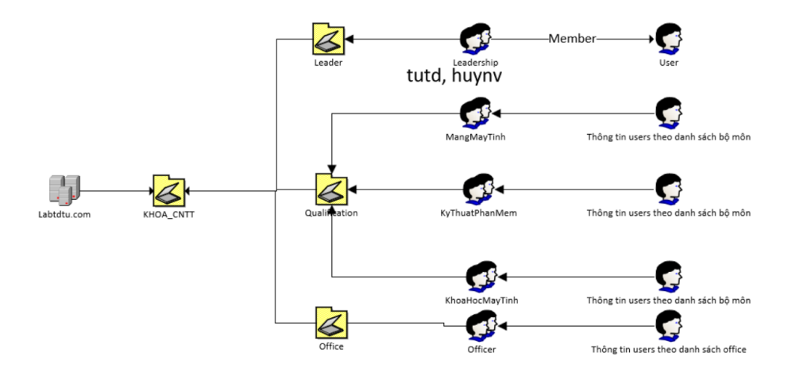
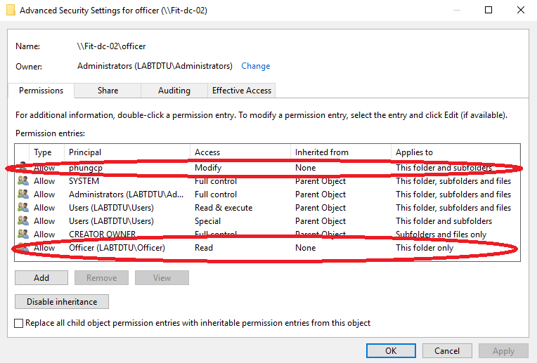
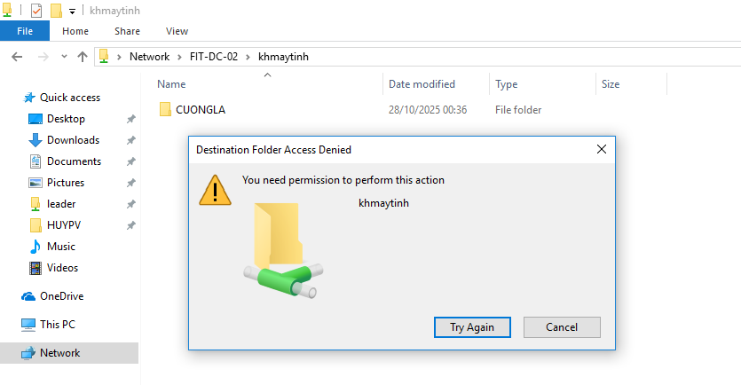
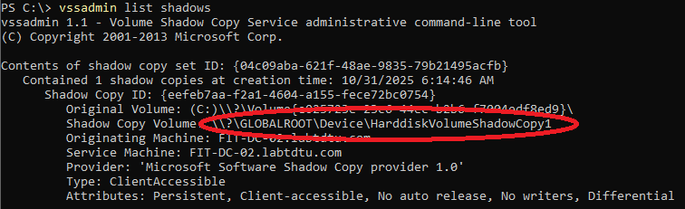
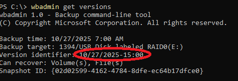
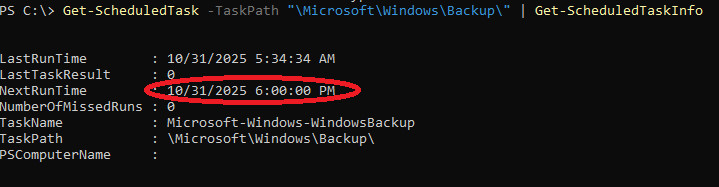
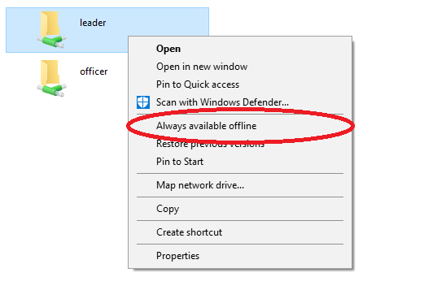
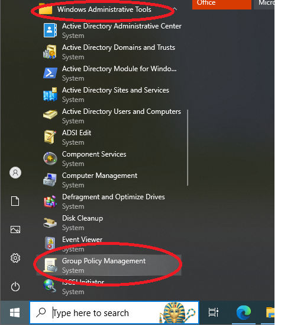
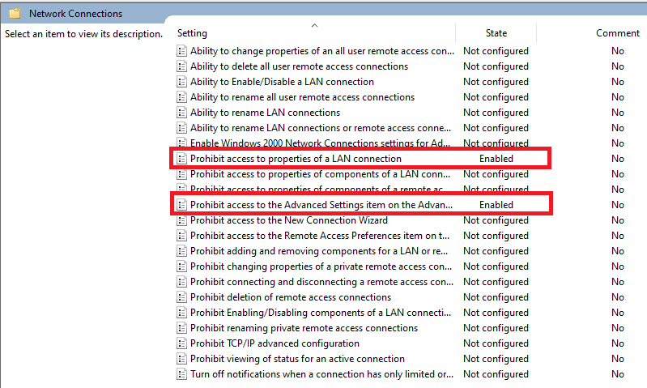
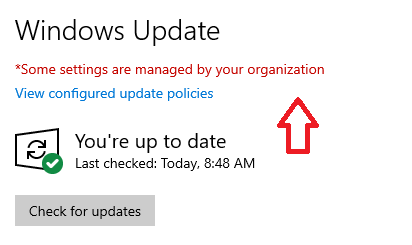

# Phân quyền và chia sẻ dữ liệu

# MỤC TIÊU

- Chia sẻ thư mục làm việc trong domain
- Phân quyền truy cập trên các thư mục chia sẻ
- Tạo bản shadow copy để khôi phục trạng thái
- Cấu hình dịch vụ Windows Backup Server
- Chia sẻ thư mục Offline

# YÊU CẦU CHUẨN BỊ

- Client: FIT-WIN10-01
- Server: FIT-DC-02 (Windows Server Core)
- 3 ổ cứng (disk) trên FIT-DC-02 gồm:
    - Volume C:\ lưu trữ hệ thống hệ điều hành Windows Server trên disk 1 (Tối thiểu)
    - Volume E:\ RAID 0 trên disk 2, 3 (~15GB) (Optional)
    - Volume F:\ RAID 1 trên disk 2, 3 (~15GB) (Optional)

***Chú thích: Xem lại thực hành buổi 4, 5, 7**

# HƯỚNG DẪN THỰC HÀNH

## 1) Cấu hình phần quyền

### Bước 1: Tạo OUs, Users, Groups trên Domain

- Khởi đầu bài thực hành, ta sẽ thực hành lại giai đoạn tạo OUs, Users, Groups trên Domain [labtdtu.com](http://labtdtu.com) theo sơ đồ được cho bên dưới bằng PowerShell tương tự lab 4, 5.
- Nếu như gặp vấn đề cấu hình trong giai đoạn có thể xem lại hướng dẫn của bài:
    - Lab 4: https://github.com/PoeenCy/Network-System-Administration-Notebook/blob/main/Chapter4_OU_GroupUser/C%E1%BA%A5u%20h%C3%ACnh%20OU%20v%C3%A0%20GroupUsers.md
    - Lab 5: https://github.com/PoeenCy/Network-System-Administration-Notebook/blob/main/Chapter5_Delegation/5%20T%E1%BA%A1o%20OU%2C%20Group%2C%20User%20v%C3%A0%20%E1%BB%A6y%20Quy%E1%BB%81n%20cho%20User.md



- Dưới đây là mẫu trình tự cú pháp tạo OUs, Users, Groups trên [labtdtu.com](http://labtdtu.com) theo sơ đồ

```powershell
# KHOA_CNTT
New-ADOrganizationalUnit -Name "KHOA_CNTT" -Path "DC=Labtdtu,DC=com"

New-ADOrganizationalUnit -Name "Leader" -Path "OU=KHOA_CNTT,DC=Labtdtu,DC=com"
New-ADOrganizationalUnit -Name "Qualification" -Path "OU=KHOA_CNTT,DC=Labtdtu,DC=com"
New-ADOrganizationalUnit -Name "Office" -Path "OU=KHOA_CNTT,DC=Labtdtu,DC=com"

# Qualification
New-ADOrganizationalUnit -Name "MangMayTinh" -Path "OU=Qualification,OU=KHOA_CNTT,DC=Labtdtu,DC=com"
New-ADOrganizationalUnit -Name "KyThuatPhanMem" -Path "OU=Qualification,OU=KHOA_CNTT,DC=Labtdtu,DC=com"
New-ADOrganizationalUnit -Name "KhoaHocMayTinh" -Path "OU=Qualification,OU=KHOA_CNTT,DC=Labtdtu,DC=com"

# Leader
New-ADGroup -Name "Leadership" -GroupScope Global -Path "OU=Leader,OU=KHOA_CNTT,DC=Labtdtu,DC=com"

# To bo mon
New-ADGroup -Name "MangMayTinh" -GroupScope Global -Path "OU=MangMayTinh,OU=Qualification,OU=KHOA_CNTT,DC=Labtdtu,DC=com"
New-ADGroup -Name "KyThuatPhanMem" -GroupScope Global -Path "OU=KyThuatPhanMem,OU=Qualification,OU=KHOA_CNTT,DC=Labtdtu,DC=com"
New-ADGroup -Name "KhoaHocMayTinh" -GroupScope Global -Path "OU=KhoaHocMayTinh,OU=Qualification,OU=KHOA_CNTT,DC=Labtdtu,DC=com"

# Office
New-ADGroup -Name "Officer" -GroupScope Global -Path "OU=Office,OU=KHOA_CNTT,DC=Labtdtu,DC=com"

$pwd = ConvertTo-SecureString "P@ssw0rd123" -AsPlainText -Force
$users=@(
@{name=”Truong Dinh Tu”;sam=”tutd”;path=”OU=Qualification,OU=Khoa_CNTT,DC=labtdtu,DC=com”},
@{name=”Le Anh Cuong”;sam=”cuongla”;path=”OU=Qualification,OU=Khoa_CNTT,DC=labtdtu,DC=com”},
@{name=”Tran Thanh Phuoc”;sam=”phuoctt”;path=”OU=Qualification,OU=Khoa_CNTT,DC=labtdtu,DC=com”}, 
@{name=”Cao Phi Phung”;sam=”phungcp”;path=”OU=Office,OU=Khoa_CNTT,DC=labtdtu,DC=com”},
@{name=”Pham Van Huy”;sam=”huypv”;path=”OU=Leader,OU=Khoa_CNTT,DC=labtdtu,DC=com”}
)

foreach ($u in $users) {
New-ADUser -Name $u.name -SamAccountName $u.sam `
-Path $u.path -AccountPassword $pwd -Enabled $true
}

#Them thanh vien vao cac nhom
Add-ADGroupMember -Identity "Leadership" -Members "tutd","huypv"
Add-ADGroupMember -Identity "MangMayTinh" -Members "tutd"
Add-ADGroupMember -Identity "KyThuatPhanMem" -Members "phuoctt"
Add-ADGroupMember -Identity "KhoaHocMayTinh" -Members "cuongla"
Add-ADGroupMember -Identity "Officer" -Members "phungcp"
```

### Bước 2: Tạo các thư mục theo sơ đồ

- Ta sẽ sử dụng câu lệnh **mkdir** quen thuộc để tạo các thư mục trên Volume RAID 0:


- Dưới đây là mẫu trình tự cú pháp tạo thư mục trên RAID 0 theo sơ đồ

```powershell
Cd E:\
mkdir CNTT
$path = @( "CNTT\KHMAYTINH","CNTT\MANGMAYTINH","CNTT\CNPHANMEM","CNTT\OFFICE","CNTT\LEADER",
    "CNTT\KHMAYTINH\CUONGLA","CNTT\CNPHANMEM\PHUOCTT","CNTT\MANGMAYTINH\TUTD","CNTT\LEADER\TUTD",
    "CNTT\LEADER\HUYPV","CNTT\OFFICE\PHUNGCP")
foreach ($p in $path) {
    mkdir $p
}

#Kiem tra lai sau khi thuc hien
dir "E:\CNTT"
```


### Bước 3: Chia sẻ các thư mục đã tạo

- Chia sẻ thư mục cho một đối tượng người dùng/nhóm cho phép đối tượng đó truy cập vào thư mục từ thiết bị Windows khác đã bật chức năng **Network Discovery** theo phạm vi (Private, Public, Domain) phù hợp và quyền hạn được cho phép
- Trên Windows ta có thể chia sẻ một thư mục bằng cách: **Click chuột phải vào thư mục mong muốn** → **Properties** → **Chuyển sang tab “Share” → Sharing…**


- **GIẢI THÍCH**
    - Read: Người dùng được chia sẻ chỉ có quyền đọc thư mục, tệp tin
    - Change: Người dùng được chia sẻ có quyền Read và tạo, thay đổi, xóa thư mục con, tệp tin
    - Full Control: Người dùng được chia sẻ có cả quyền Change, Read và thay đổi quyền hạn chia sẻ
    
- Trên CLI ta chia sẻ một thư mục bằng cách dùng các câu lệnh **SMBShare**

```powershell
New-SMBShare -name "<Ten Shared Folder>" -path "<Duong dan folder muon share>" -<ReadAccess|ChangeAccess|ReadAccess> "<Doi tuong ap dung>"
```

- Mẫu cấp quyền truy cập cho mỗi thư mục chia sẻ theo từng đối tượng người dùng của yêu cầu

```powershell
New-SMBShare -name "LEADER" -path "E:\CNTT\LEADER" -ReadAccess "labtdtu.com\LeaderShip" -FullAccess "labtdtu.com\huypv"
New-SMBShare -name "MANGMAYTINH" -path "E:\CNTT\MANGMAYTINH" -ReadAccess "labtdtu.com\Mangmaytinh" -ChangeAccess "labtdtu.com\tutd"
New-SMBShare -name "CNPHANMEM" -path "E:\CNTT\CNPHANMEM" -ReadAccess "labtdtu.com\kythuatphanmem" -ChangeAccess "labtdtu.com\phuoctt"
New-SMBShare -name "OFFICER" -path "E:\CNTT\OFFICE" -ReadAccess "labtdtu.com\Officer" -ChangeAccess "labtdtu.com\phungcp"
New-SMBShare -name "KHMAYTINH" -path "E:\CNTT\KHMAYTINH" -ReadAccess "labtdtu.com\Khoahocmaytinh" -ChangeAccess "labtdtu.com\cuongla"
```

- Nếu muốn bổ sung / thay đổi các quyền cho đối tượng người dùng:

```powershell
Grant-SMBShareAccess -name "LEADER" -AccountName "labtdtu.com\huypv" -AccessRight Full
```

**Tham số cho New-SMBShare**

FullAccess

ChangeAccess

ReadAccess

**Tham số cho Grant-SMBShareAccess**

Full

Change

Read

**Quyền share tương ứng**

Full Control

Change

Read

- Nếu muốn thu hồi quyền truy cập thư mục của người dùng

```powershell
Revoke-SMBShareAccess -name "LEADER" -AccountName "labtdtu.com\huypv" 
```

- Sau khi cấu hình quyền truy cập thư mục chia sẻ, ta thực hiện kiểm tra:

```powershell
Get-SMBShareAccess -name "LEADER"
```


- Để vào thư mục chia sẻ, trên FIT-WIN10-01 sau khi đăng nhập: vào **File Explorer** → **Network** → **FIT-DC-02 ****hoặc gõ **Win + R → \\FIT-DC-02**


### Bước 4: Phân quyền truy cập thư mục ở cấp độ hệ thống tập tin NTFS

***KẾ THỪA**

- Kế thừa quyền là cơ chế cho phép khi cấu hình quyền truy cập cho một đối tượng trên một thư mục, các quyền truy cập đó sẽ được áp dụng tự động cho các thư mục con, tệp tin bên trong mà không cần phải lặp lại thao tác. Nó giúp tiết kiệm thời gian và tăng tính nhất quán nhưng cũng đòi hỏi phải kiểm soát nếu không muốn áp dụng lên sai thư mục hoặc tệp tin
- Trên hệ điều hành Windows ta có thể áp dụng kế thừa trên một thư mục theo cách sau: **Click chuột phải vào thư mục** → **Properties** → **Tab “Security”** → **Advanced** → **Chọn một đối tượng người dùng/nhóm muốn áp dụng** → **Nhấn “Edit”** → Tại phần **“Applies to” mở rộng thanh chọn** sẽ hiện ra tuy chọn như hình sau:


- Đối với CLI chỉ có thể sử dụng dòng lệnh, ta có thể sử dụng công cụ **icacls** để cấu hình với các flag tương ứng theo bảng dưới:


**Flag**

(None / Không) 

(NP)

(OI)(CI)

(CI)

(OI)

(IO)(CI)(OI)

(CI)(IO)

(OI)(IO)

**Dạng kế thừa tương ứng**

This folder only

No Inherit

This folder, subfolders and files

This folder and subfolders

This folder and files

Subfolders and files only

Subfolders only

Files only

- Để bật hoặc tắt chức năng kế thừa trên thư mục hiện tại ta sử dụng cú pháp sau:

```powershell
#Bat chuc nang ke thua
icacls "E:\CNTT\LEADER" /inheritance:e
#Tat chuc nang ke thua
icacls "E:\CNTT\LEADER" /inheritance:d
```

- Ví dụ cấp quyền đọc cho domain users trên thư mục LEADER, áp dụng chỉ thư mục hiện tại và tệp tin, thư mục LEADER sẽ không kế thừa các quyền từ thư mục cha là CNTT

```powershell
icacls "E:\CNTT\LEADER" /inheritance:d
icacls "E:\CNTT\LEADER" /grant "labtdtu.com\LEADERSHIP:(OI)(R)"
```

***CẤU HÌNH QUYỀN TRUY CẬP THƯ MỤC CHO ĐỐI TƯỢNG NGƯỜI DÙNG**

- Để 3 quyền từ thư mục chia sẻ có hiệu lực và có thể cấu hình các quyền nâng cao khác, ta **bắt buộc phải cấu hình ở tầng hệ thống tập tin NTFS**. Tương tự như kế thừa ta cũng sẽ sử dụng công cụ **icacls** với các code tương ứng với các quyền hiển thị trên GUI trong bảng và hình phía dưới:


**Code**

F

X

R

RX

W

M

RA

REA

RD

WD

AD

WA

WEA

D  / DE

DC

WO

RC

WDAC

(CI)(RX)

**Quyền tương ứng**

Full control

Traverse folder / execute file

Read

Read & Execute

Write

Modify

Read attributes

Read extended attributes

List folder / read data

Create files / write data

Create folders / append data

Write attributes

Write extended attributes

Delete

Delete subfolder and files

Take ownership

Read Permission

Change Permission

List folder content

- Có thể sử dụng câu lệnh **icacls /?** để tra cứu cú pháp cấp quyền
- Ví dụ ta muốn cấp quyền hoặc chặn quyền đọc trên nhóm mặc định domain users trên thư mục CNTT, ta có thể sử dụng các cú pháp từ công cụ icacls để thực hiện điều đó:

```powershell
#Cap quyen doc tren domain users
icacls "E:\CNTT" /grant "labtdtu.com\Domain Users:(R)"
#Chan quyen doc tren domain users
icacls "E:\CNTT" /deny "labtdtu.com\Domain Users:(R)"
```

***THỰC HIỆN CẤU QUYỀN NTFS THEO YÊU CẦU ĐỀ BÀI**


```powershell
icacls "E:\CNTT\LEADER" /inheritance:e
icacls "E:\CNTT\LEADER" /grant "labtdtu.com\LEADERSHIP:(OI)(R)"

icacls "E:\CNTT\MANGMAYTINH" /inheritance:e
icacls "E:\CNTT\MANGMAYTINH" /grant "labtdtu.com\MANGMAYTINH:(OI)(R)"

icacls "E:\CNTT\OFFICE" /inheritance:e
icacls "E:\CNTT\OFFICE" /grant "labtdtu.com\OFFICER:(R)"

icacls "E:\CNTT\CNPHANMEM" /inheritance:e
icacls "E:\CNTT\CNPHANMEM" /grant "labtdtu.com\Kythuatphanmem:(OI)(IO)(R)"

icacls "E:\CNTT\KHMAYTINH" /inheritance:d
icacls "E:\CNTT\KHMAYTINH" /grant "labtdtu.com\KHOAHOCMAYTINH:(NP)(OI)(CI)(R)"
```


```powershell
icacls "E:\CNTT\LEADER" /grant "labtdtu.com\huypv:(OI)(CI)(F)"

icacls "E:\CNTT\MANGMAYTINH" /inheritance:e
icacls "E:\CNTT\MANGMAYTINH" /grant "labtdtu.com\tutd:(OI)(CI)(M)"

icacls "E:\CNTT\OFFICE" /inheritance:e
icacls "E:\CNTT\CNPHANMEM" /grant "labtdtu.com\phuoctt:(OI)(CI)(R,W)"

icacls "E:\CNTT\OFFICE" /inheritance:e
icacls "E:\CNTT\OFFICE" /grant "labtdtu.com\phungcp:(CI)(M)"

icacls "E:\CNTT\KHMAYTINH" /grant "labtdtu.com\cuongla:(OI)(CI)(IO)(R,W,RX)"
```

- Nếu như muốn xóa quyền của một đối tượng người dùng để thực hiện cấp quyền lại ta có thể dùng lệnh:

```powershell
icacls "E:\CNTT\LEADER" /remove "labtdtu.com\huypv"
```

- Xóa các quyền không cần thiết (Nếu có)

```powershell
#Vi du xoa cac quyen mac dinh Users cua thu muc CNTT, file va thu muc con cua CNTT
icacls "E:\CNTT" /inheritance:d
icacls "E:\CNTT" /remove "BUILTIN\Users"
```

- Sau khi đã cấp quyền đầy đủ cho mỗi đối tượng theo yêu cầu, ta có thể kiểm tra bằng:

```powershell
icacls "E:\CNTT\MANGMAYTINH"
```


### Bước 5: Kiểm thử trên thiết bị Client

- Trên FIT-WIN10-01 thực hiện đăng nhập bằng bất kỳ tài khoản được tạo ở phần đầu tiên. Sau đó vào giao diện Command Prompt hoặc nhấn tổ hợp **Win + R** và gõ dòng lệnh sau để cập nhật chính sách mới nhất từ domain

```powershell
gpupdate
```

- Lúc này ta sẽ thử tiến hành thử các thao tác đọc, tạo, xóa, thay đổi trên thư mục, tệp tin trong thư mục chia sẻ
- Ta có thể dùng tài khoản quản trị để kiểm tra danh sách quyền: **Click chuột phải vào thư mục** → **Properties**  → **Vào tab “Security”** → **Nhấn “Advanced”** (Chuyển sang tab “Share” nếu muốn xem quyền SMBShare)
- Ghi nhận kết quả và làm tương tự với các tài khoản người dùng còn lại





- Đăng nhập tài khoản huypv và tạo file DETAI_CNTT2.txt trong thư mục LEADER\HUYPV → Chắc chắn tạo thành công


## 2) Cấu hình bản sao bóng Shadow copy

### Bước 1: Cấu hình và tạo một điểm lưu bản shadow copy

```powershell
#Tao vung nho luu tru ban sao bong shadow copy voi dung luong 2GB
vssadmin add shadowstorage /for=E: /on=E: /maxsize=2GB

vssadmin list shadowstorage

#Tao mot ban sao bong shadow copy
vssadmin create shadow /for=E:

vssadmin list shadows
```

### Bước 2: Giả định thay đổi dữ liệu

- Với tài khoản huypv, xóa tệp DETAI_CNTT2 đã tạo và tạo thư mục “TAI LIEU MAT”


### Bước 3: Khôi phục lại trạng thái trước bằng shadow copy

- Sử dụng câu lệnh **vssadmin list shadows** để kiểm tra đường dẫn shadow copy



- Đối với giao diện GUI ta thực hiện khôi phục vô cùng dễ dàng so với CLI vẫn còn hạn chế. Ta vẫn có thể khôi phục bằng sao chép thủ công dữ liệu trong shadow copy đến vị trí đường dẫn mong muốn.

```powershell
#Tao thu muc lien ket voi duong dan shadow copy
mklink /d C:\ShadowCopy \\?\GLOBALROOT\Device\HarddiskVolumeShadowCopy1\

#Copy du lieu ben trong thu muc lien ket den vi tri can khoi phuc
robocopy C:\ShadowCopy\ E:\ /E

#Xoa thu muc lien ket
rmdir C:\ShadowCopy
```

## 3) Cài đặt và cấu hình chức năng Windows Server Backup

### Bước 1: Cài đặt chức năng Windows Server Backup

```powershell
Install-WindowsFeature Windows-Server-Backup -IncludeManagementTools
```

### Bước 2: Backup dữ liệu

- Backup dữ liệu thư mục CNTT trên RAID 0 sang RAID 1

```powershell

wbadmin start backup -backupTarget:F: -include:E:\CNTT -quiet
```

### Bước 3: Giả định tình huống Recovery dữ liệu

```powershell
wbadmin get versions 
```



```powershell

#>>> Vi du: Timestamp: 10/27/2025-15:00
wbadmin start recovery -version:<timestamp> -itemtype:File -items:E:\CNTT -recoveryTarget:E:\ -quiet
```


### Bước 4: Lập lịch Backup

```powershell
wbadmin enable backup -addtarget:F: -include:E:\CNTT -schedule:18:00 -quiet
Get-ScheduledTask -TaskPath "\Microsoft\Windows\Backup\" | Get-ScheduledTaskInfo
```



## 4) Chia sẻ thư mục Offline

### Bước 1: Bật chức năng cache trên thư mục

**Chế độ**

None

Manual

Documents

Programs

**Ý nghĩa**

Tắt chức năng tải thư mục, tệp tin ngoại tuyến

Tải thư mục, tệp tin ngoại tuyến thủ công

Tự động tải xuống bản sao Cache các tài liệu mà người dùng đã mở

Máy chủ sẽ tự động tải xuống các tệp thực thi để chạy ở chế độ ngoại tuyến

```powershell
#Mac dinh Share thu muc se o che do manual, ta se off 1 thu muc
Set-SMBShare -name "CNPHANMEM" -cachingmode none

#Chuyen lai sang Manual
Set-SMBShare -name "LEADER" -cachingmode Manual

#Kiem tra trang thai sau khi cau hinh
-
```


### Bước 2: Kiểm thử chức năng offline trên thư mục

- Trên Client FIT-WIN10-01, Ta click chuột phải vào thư mục chia sẻ và quan sát. Chỉ có các thư mục đã bật Cache và người dùng đủ quyền truy cập mới hiện “Always available offline”
- Ta click vào “Always available offline” để thực hiện đồng bộ về máy client




- Khi đã đồng bộ xong, ta tiến hành tắt Server FIT-DC-02 rồi quay lại Client làm mới lại giao diện và quan sát


# MỞ RỘNG - CẤU HÌNH CHÍNH SÁCH NHÓM (GPO)

## 1) Tạo GPO, liên kết với OU, domain và áp dụng chính sách

### Bước 1: Tạo các GPO

```powershell
New-GPO -name "CNTT GPO"
New-GPO -name "labtdtu GPO"
```

Sử dụng câu lệnh sau để liệt kê các GPO hiện có

```powershell
Get-GPO -all
```


### Bước 2: Liên kết GPO với OU, domain

- Các GPO sau khi khởi tạo cần được liên kết với một OU hoặc domain để xác định phạm vi đối tượng được áp dụng trong domain

```powershell
New-GPLink -name "CNTT GPO" -target "OU=Khoa_CNTT,DC=labtdtu,DC=com"
New-GPLink -name "labtdtu GPO -target "DC=labtdtu,DC=com"
```

### Bước 3: Thêm các chính sách vào GPO

- Một GPO sẽ được áp dụng cho hai đối tượng là người dùng và máy tính, một chính sách trong GPO có thể được đặt ở mức người dùng, mức máy tính hoặc cả hai
- Đối với GUI ta có thể chỉnh sửa dễ dàng bằng các Administrative Template có sẵn được hiển thị trong GPMC
- Riêng với CLI sẽ không có thao tác giao diện và ta có thể thực hiện thêm các chính sách bằng một số phương pháp như thêm giá trị **Khóa Registry** vào GPO thông qua Powershell
- Trong GPO sẽ có hai nhánh khóa Registry chính tương ứng với người dùng và máy tính:
    - **HKEY_LOCAL_MACHINE (HKLM):** Chính sách sẽ được áp dụng cho đối tượng máy tính
    - **HKEY_CURRENT_USER (HKCU):** Chính sách sẽ được áp dụng cho đối tượng người dùng
- Registry thêm trên GPO sẽ có các loại kiểu dữ liệu sau:
    - **DWORD:** kiểu số nguyên 32-bit
    - **BINARY:** kiểu nhị phần hay chuỗi byte
    - **String:** Kiểu chuỗi ký tự
    - **ExpandString:** là String nhưng cho phép mở rộng thêm vào các biến môi trường VD: %SystemRoot%
    - **MultiString:** là String nhưng cho phép tạo nhiều chuỗi
- Để thêm các giá trị Registry vào một GPO, ta có thể thực hiện bằng câu lệnh sau:

```powershell
Set-GPRegistryValue -Name "<Ten GPO>" -Key "<Duong Dan khoa Registry>" -ValueName "<Ten gia tri Registry>" `
-Type <DWORD|BINARY|String|MultiString> -Value <Gia tri tham so theo Type>
```

- Ta có thể dùng câu lệnh sau để truy vấn các dữ liệu hiện có:

```powershell
reg query "<Duong dan Registry>"
```


- Tuy nhiên trên hệ điều hành Windows sẽ không hiển thị hoàn toàn các Registry do chưa được cấu hình đòi hỏi ta phải tự tìm hiểu và thêm vào các khóa hoặc giá trị Registry tương ứng. Một số ví dụ chính sách sử dụng Registry sẽ được kể đến ở phần sau

### *Tắt tự động Update hệ điều hành Windows

```powershell
Set-GPRegistryValue -Name "labtdtu GPO" `
 -Key "HKLM\Software\Policies\Microsoft\Windows\WindowsUpdate\AU" `
 -ValueName "NoAutoUpdate" -Type DWord -Value 1
```

### *Ngăn chặn thay đổi IP máy tính

- Chặn người dùng vào properties thay đổi địa chỉ IP

```powershell
Set-GPRegistryValue -Name "labtdtu GPO" `
 -Key "HKCU\Software\Policies\Microsoft\Windows\Network Connections" `
 -ValueName "NC_LanProperties" -Type DWord -Value 0
Set-GPRegistryValue -Name "labtdtu GPO" `
 -Key "HKCU\Software\Policies\Microsoft\Windows\Network Connections" `
 -ValueName "NC_AdvancedSettings" -Type DWord -Value 0
```

### *Ngăn chặn mở công cụ

- Chặn người dùng sử dụng Task Manager để theo dõi tiến trình

```powershell
Set-GPRegistryValue -Name "CNTT GPO" `
 -Key "HKCU\Software\Microsoft\Windows\CurrentVersion\Policies\System" `
 -ValueName "DisableTaskMgr" -Type DWord -Value 1
```

- Chặn người dùng vào Control Panel để cố gắng thay đổi cấu hình máy

```powershell
Set-GPRegistryValue -Name "CNTT GPO" `
 -Key "HKCU\Software\Microsoft\Windows\CurrentVersion\Policies\Explorer" `
 -ValueName "NoControlPanel" -Type DWord -Value 1
```

### *Thay đổi trang mặc định trên trình duyệt Edge

- Thay đổi trang mặc định của Edge thành duyệt trang web [tdtu.edu.vn](http://tdtu.edu.vn) khi người dùng khởi động trình duyệt

```powershell
Set-GPRegistryValue -Name "labtdtu GPO" `
  -Key "HKLM\Software\Policies\Microsoft\Edge" `
  -ValueName "NewTabPageLocation" -Type String -Value "https://tdtu.edu.vn"
```

### Bước 4: Kích hoạt trạng thái GPO

- Trên một GPO ta có 4 trạng thái có thể chọn:

**Tên trạng thái**

User Configuration Settings Disabled

Computer Configuration Settings Disabled

All Settings Disabled

Enabled

**Tham số tương ứng trên Powershell**

UserSettingsDisabled

ComputerSettingsDisabled

AllSettingsDisabled

AllSettingsEnabled

**Ý nghĩa**

Tắt trên đối tượng người dùng

Tắt trên đối tượng máy tính

Tắt hoàn toàn GPO

Bật trên cả hai đối tượng

- Ta có thể thay đổi trạng thái GPO sang bật bằng câu lệnh sau:

```powershell
Set-GPO -Name "CNTT GPO" -GpoStatus AllSettingsEnabled
Set-GPO -Name "labtdtu GPO" -GpoStatus AllSettingsEnabled
```

### Bước 5: Cập nhật chính sách gpo trên client

- Sau khi cấu hình các đối tượng GPO trên domain, tại máy client FIT-WIN10-01 nhấn tổ hợp **WIN + R** và gõ câu lệnh sau để cập nhật các chính sách mới nhất

```powershell
gpupdate
```

## 2) Quản lý GPO từ xa qua client bằng RSAT

### Bước 1: Tải và cài đặt công cụ GPMC RSAT

- Trên client FIT-WIN10-01 đăng nhập bằng tài khoản có quyền quản trị như Administrator
- Mở Powershell và thực hiện dòng lệnh sau để tải xuống công cụ RSAT GPMC

```powershell
Add-WindowsCapability -Online -Name Rsat.GroupPolicy.Management.Tools~~~~0.0.1.0
```

- Sau khi tải và cài đặt thành công, ta nhấn WIN + R → gõ “gpmc.msc” hoặc nhấn nút Start → Tìm “Windows Administrative Tools” → Chọn Group Policy Management để chạy GPMC




### Bước 2: Kiểm tra trạng thái của chính sách trên GPO qua RSAT

- Với GPMC RSAT ta có thể cấu hình các GPO trên domain thông qua client là thiết bị Windows giao diện mà quản trị viên
- Trên đây ta sẽ xem lại các thay đổi GPO do cấu hình ở FIT-DC-02.
- Ví dụ kiểm tra chính sách “Không cho phép thay đổi IP” đã được cấu hình từ trước: Click chuột phải vào CNTT GPO → Chọn Edit… → User Configuration → Policies → Administrative Templates → Network → Network Connections - Một số chính sách mẫu sẽ Enabled như hình dưới




### Bước 3: Kiểm thử tác động của các chính sách GPO lên client

### *Thay đổi IP

- Khi vào trang quản lý card mạng Network Connections và chuột phải vào một card mạng → Phần Properties sẽ bị mờ và không cho phép người dùng chọn để cấu hình


### *Windows Update

- Vào phần settings → Chọn mục Update & Security → tại mục Windows Update sẽ hiển thị dòng chữ “Some settings are managed by your Organization” như hình dưới. Tức máy tính sẽ không tự động tải bản cập nhật



### *Các công cụ hệ thống

- **TaskManager:** Khi click chuột phải vào thanh taskbar, mục Task Manager sẽ bị mờ đi và không cho mở


- **Control Panel:** Người dùng bị áp dụng chính sách sẽ không thể thấy biểu tượng control panel, nếu cố gắng mở sẽ hiển thị thông báo từ chối như hình dưới:


### *Trình duyệt Edge

- Khi người dùng mở trình duyệt Edge sẽ bị điều hướng sang trang [tdtu.edu.vn](http://tdtu.edu.vn) ngay cả khi mở sang tab mới


## 3) Tạo bản backup chính sách nhóm GPO

### Bước 1: Tạo bản backup GPO

- Backup GPO có thể được sử dụng cho nhiều mục đích khác nhau, một số có thể kể đến:
    - Di dời qua GPO khác để tái sử dụng
    - Tạo ra nhiều phiên bản thay đổi khác nhau để so sánh hoặc dự phòng cho việc khôi phục lại trạng thái trước nếu cấu hình chính sách bị lỗi
    - Tách biệt giữa GPO thử nghiệm và GPO đang dùng chính thức
- Ta thực hiện backup theo trình từ câu lệnh sau:

```powershell
mkdir "C:\BACKUP_CNTT_GPO"
Backup-GPO -Name "CNTT GPO" -Path "C:\BACKUP_CNTT_GPO"
```


### Bước 2: Giả định trường hợp backup GPO

- Ta sẽ thử thực hiện thay đổi một số chính sách của GPO đã được backup qua RSAT GPMC trên client
- Ví dụ hình phía dưới là chính sách “Allow antimalware service to startup with normal priority” chuyển từ Not Configured → Disabled


### Bước 3: Khôi phục lại các chính sách trong GPO

- Với các thay đổi các cấu hình chính sách trong GPO, ta sẽ thử khôi phục lại bằng câu lệnh sau:

```powershell
Import-GPO -BackupGpoName "CNTT GPO" -TargetName "CNTT GPO" -Path C:\BACKUP_CNTT_GPO"
```


- Rồi sau đó ta quay lại RSAT GPMC trên client, làm mới lại chính sách (gpupdate) và trang GPMC rồi sau đó kiểm tra lại các mẫu chính sách đã thay đổi khác với backup → (GPO phải quay lại trạng thái giống nguyên vẹn như lúc backup)